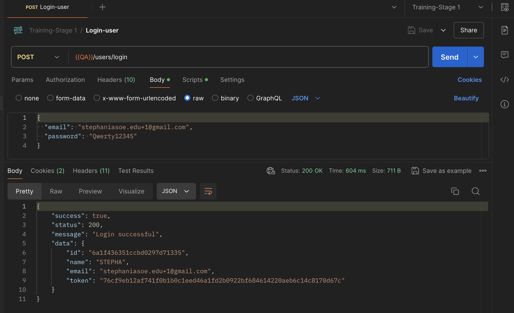
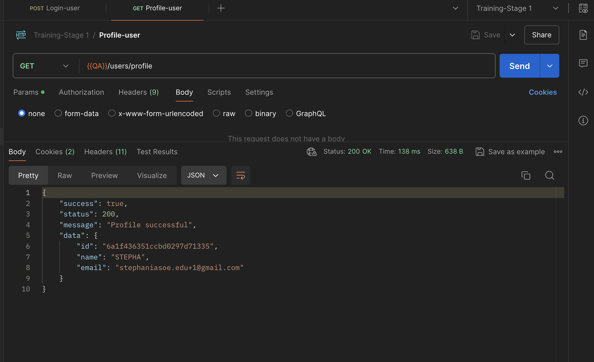
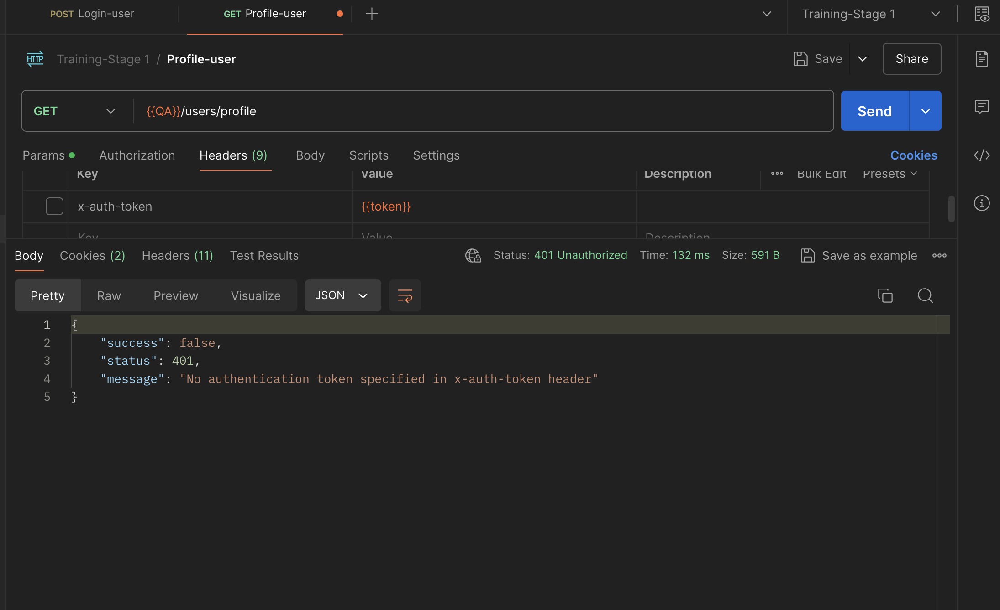
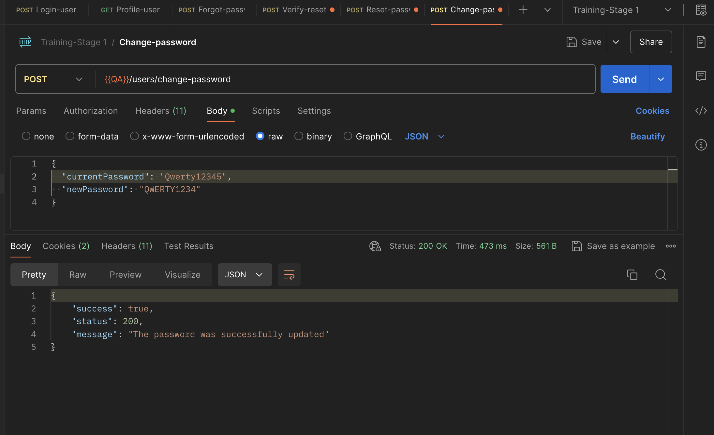
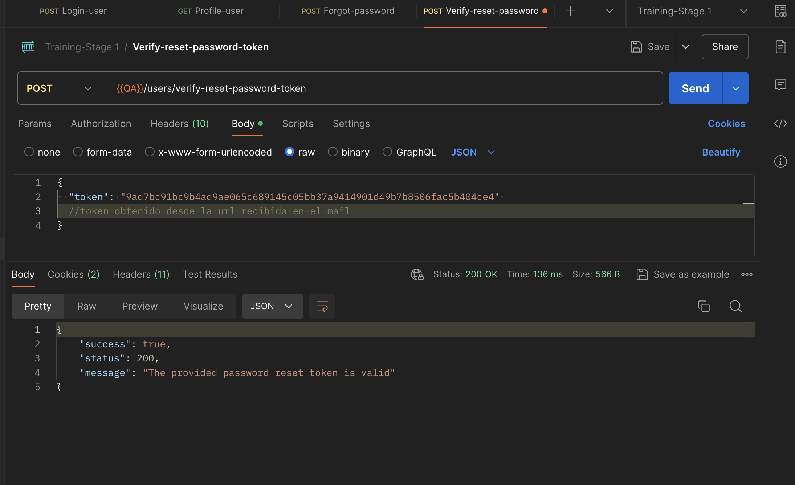
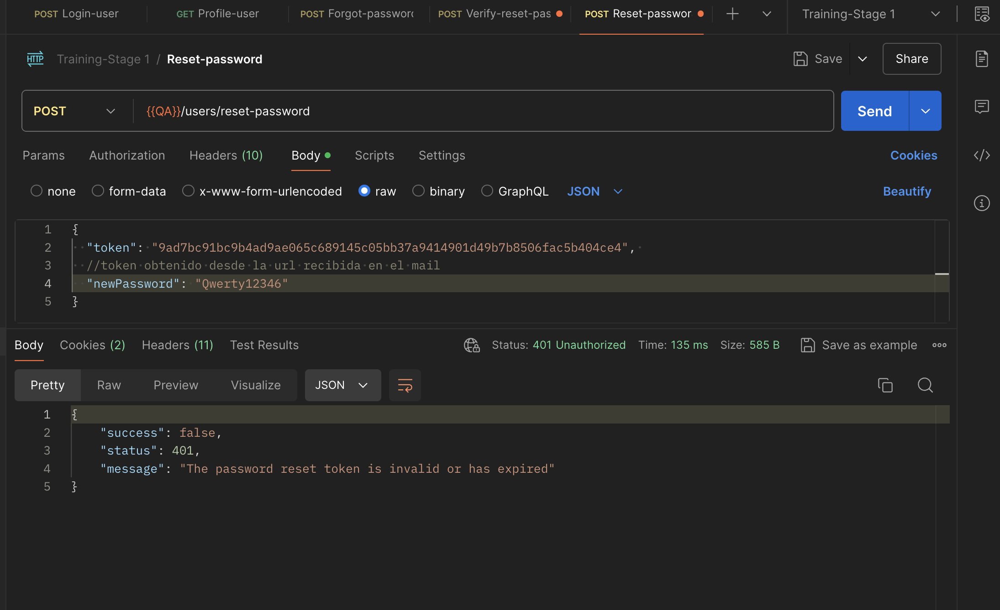
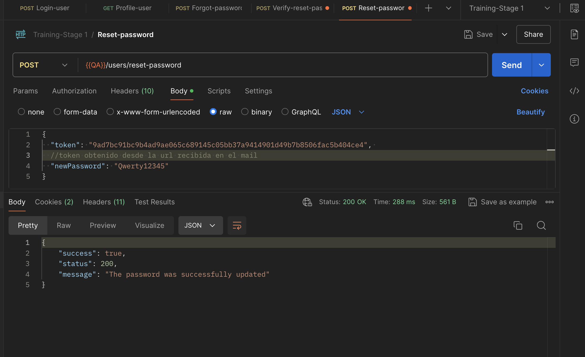

# Entrega: Pruebas de API - Gestión de Cuenta de Usuario

## Objetivo / Historia de usuario

El objetivo de esta entrega es validar mediante Postman los servicios relacionados con la gestión de cuenta de un usuario registrado, incluyendo la consulta de perfil, el cambio de contraseña y la recuperación de cuenta.

**Historia de usuario:**

Como usuario registrado de la aplicación,
quiero poder consultar mi perfil, cambiar mi contraseña y recuperar mi cuenta si olvido mi clave,
para mantener el acceso a mis notas y gestionar mi cuenta de forma segura.

---

## Criterios de aceptación

* El usuario registrado debe poder consultar la información de su perfil mediante un endpoint protegido.
* El sistema debe impedir la consulta del perfil si no se envía un token de autenticación.
* El sistema debe rechazar la consulta del perfil cuando se use un token inválido.
* El usuario debe poder cambiar su contraseña si envía correctamente su contraseña actual.
* El sistema no debe permitir el cambio de contraseña cuando la contraseña actual sea incorrecta.
* El sistema debe validar que la nueva contraseña cumpla con las reglas de seguridad.
* El usuario debe poder iniciar sesión con la nueva contraseña después del cambio.
* El usuario no debe poder iniciar sesión con la contraseña anterior después de actualizarla.
* El usuario debe poder solicitar recuperación de cuenta con un correo registrado.
* El sistema no debe procesar la recuperación cuando el correo no esté registrado o tenga un formato inválido.
* El usuario debe poder restablecer su contraseña usando un enlace o token de recuperación válido.
* El sistema debe rechazar enlaces o tokens de recuperación inválidos o expirados.

---

## Estrategia de prueba

Las pruebas se ejecutaron en Postman, validando los endpoints de la API relacionados con autenticación y gestión de cuenta.

Se probaron flujos positivos y negativos para verificar el comportamiento esperado de la API en diferentes escenarios.

Las funcionalidades cubiertas fueron:

1. Consulta de perfil.
2. Cambio de contraseña.
3. Recuperación de cuenta.

### Precondiciones generales

* La API debe estar disponible.
* El usuario debe estar registrado en la aplicación.
* Para los endpoints protegidos, se debe contar con un token válido.
* El token se obtiene al ejecutar el endpoint de login.
* En Postman se debe configurar una variable de entorno para reutilizar el token en las demás peticiones.

### Datos de prueba utilizados

| Dato                    | Valor de ejemplo                              |
| ----------------------- | --------------------------------------------- |
| Nombre de usuario       | Stepha                                    |
| Correo registrado       | [stephaniasoe.edu+1]       |
| Contraseña actual       | Qwerty123                                  |
| Nueva contraseña válida | Qwerty1234                               |
| Contraseña incorrecta   | Qwerty                             |
| Correo no registrado    | [stephaniasoe.edu+11@gmail.com] |
| Correo inválido         | [stephaniasoe.edu+11]                              |
| Token válido            | Obtenido desde el endpoint de login           |
| Token inválido          | Valor alterado                      |

---

## Casos de prueba en Gherkin BDD

### Feature 1: Consulta de Perfil

```Gherkin
Feature: Consulta de perfil por API

  Como usuario registrado
  Quiero consultar la información de mi perfil mediante la API
  Para validar que mis datos estén disponibles correctamente

  Background:
    Given que el usuario está registrado en la aplicación

  Scenario: CP01 - Consultar perfil correctamente
    Given que el usuario inició sesión desde Postman con credenciales válidas
    And obtuvo un token de autenticación válido
    When envía una petición GET al endpoint de perfil
    And envía el token en el header Authorization
    Then la API debe responder con status code 200
    And la respuesta debe mostrar los datos del usuario
    And la respuesta debe incluir el nombre del usuario
    And la respuesta debe incluir el correo electrónico del usuario

  Scenario: CP02 - Consultar perfil sin token
    Given que el usuario no envía token de autenticación
    When envía una petición GET al endpoint de perfil
    Then la API debe responder con status code 401
    And debe mostrarse un mensaje indicando que el usuario no está autorizado

  Scenario: CP03 - Consultar perfil con token inválido
    Given que el usuario envía un token inválido
    When envía una petición GET al endpoint de perfil
    Then la API debe responder con status code 401
    And debe mostrarse un mensaje indicando que el token no es válido
```

---

### Feature 2: Cambio de Contraseña

```Gherkin
Feature: Cambio de contraseña por API

  Como usuario registrado
  Quiero cambiar mi contraseña actual mediante la API
  Para proteger el acceso a mi cuenta

  Background:
    Given que el usuario está registrado en la aplicación
    And inició sesión desde Postman con credenciales válidas
    And cuenta con un token de autenticación válido

  Scenario: CP04 - Cambiar contraseña correctamente
    Given que el usuario conoce su contraseña actual
    When envía una petición al endpoint de cambio de contraseña
    And envía su contraseña actual correctamente
    And envía una nueva contraseña válida
    And envía el token en el header Authorization
    Then la API debe responder con status code 200
    And la contraseña debe actualizarse correctamente
    And debe mostrarse un mensaje de actualización exitosa

  Scenario: CP05 - Cambiar contraseña usando una contraseña actual incorrecta
    Given que el usuario quiere cambiar su contraseña
    When envía una petición al endpoint de cambio de contraseña
    And envía una contraseña actual incorrecta
    And envía una nueva contraseña válida
    And envía el token en el header Authorization
    Then la API debe responder con status code 400 o 401
    And la contraseña no debe actualizarse
    And debe mostrarse un mensaje indicando que la contraseña actual es incorrecta

  Scenario: CP06 - Cambiar contraseña usando una nueva contraseña inválida
    Given que el usuario quiere cambiar su contraseña
    When envía una petición al endpoint de cambio de contraseña
    And envía su contraseña actual correctamente
    And envía una nueva contraseña que no cumple las reglas de seguridad
    And envía el token en el header Authorization
    Then la API debe responder con status code 400
    And la contraseña no debe actualizarse
    And debe mostrarse un mensaje indicando que la nueva contraseña no es válida

  Scenario: CP07 - Iniciar sesión con la nueva contraseña
    Given que el usuario cambió su contraseña correctamente
    When envía una petición POST al endpoint de login
    And usa el correo registrado y la nueva contraseña
    Then la API debe responder con status code 200
    And debe retornar un token de autenticación válido

  Scenario: CP08 - Iniciar sesión con la contraseña anterior
    Given que el usuario cambió su contraseña correctamente
    When envía una petición POST al endpoint de login
    And usa el correo registrado y la contraseña anterior
    Then la API debe responder con status code 401
    And debe mostrarse un mensaje de credenciales inválidas
```

---

### Feature 3: Recuperación de Cuenta

```Gherkin
Feature: Recuperación de cuenta por API

  Como usuario registrado
  Quiero recuperar mi cuenta si olvido mi contraseña
  Para no perder el acceso a mis notas

  Background:
    Given que el usuario está registrado en la aplicación

  Scenario: CP09 - Solicitar recuperación con correo registrado
    Given que el usuario olvidó su contraseña
    When envía una petición al endpoint de recuperación de cuenta
    And envía un correo registrado
    Then la API debe responder con status code 200
    And debe mostrarse un mensaje confirmando el envío de instrucciones de recuperación

  Scenario: CP10 - Solicitar recuperación con correo no registrado
    Given que el usuario olvidó su contraseña
    When envía una petición al endpoint de recuperación de cuenta
    And envía un correo no registrado
    Then la API debe responder con status code 404
    And debe mostrarse un mensaje indicando que el correo no existe

  Scenario: CP11 - Solicitar recuperación con correo inválido
    Given que el usuario olvidó su contraseña
    When envía una petición al endpoint de recuperación de cuenta
    And envía un correo con formato inválido
    Then la API debe responder con status code 400
    And debe mostrarse un mensaje indicando que el correo no es válido

  Scenario: CP12 - Restablecer contraseña con token válido
    Given que el usuario recibió un token o enlace de recuperación válido
    When envía una petición al endpoint de restablecimiento de contraseña
    And envía una nueva contraseña válida
    Then la API debe responder con status code 200
    And la contraseña debe restablecerse correctamente
    And debe mostrarse un mensaje de confirmación

  Scenario: CP13 - Restablecer contraseña con token inválido o expirado
    Given que el usuario tiene un token o enlace de recuperación inválido o expirado
    When envía una petición al endpoint de restablecimiento de contraseña
    And envía una nueva contraseña válida
    Then la API debe responder con status code 400 o 401
    And la solicitud debe ser rechazada
    And debe mostrarse un mensaje indicando que el token no es válido o expiró
```

---

## Ejecución

Las pruebas fueron ejecutadas manualmente en Postman, enviando peticiones HTTP a los endpoints correspondientes de la API.

### Pasos generales de ejecución

1. Abrir Postman.
2. Configurar el ambiente de pruebas.
3. Crear las variables necesarias.
4. Ejecutar el endpoint de login para obtener el token.
5. Guardar el token en una variable de entorno.
6. Usar el token en los endpoints protegidos mediante el header `Authorization`.
7. Ejecutar cada caso de prueba.
8. Validar:

   * Status code.
   * Mensaje de respuesta.
   * Estructura del body.
   * Datos retornados por la API.
9. Guardar evidencias de los resultados obtenidos.


## Resultados

Los resultados de las pruebas se validaron directamente en Postman revisando:

* Código de respuesta HTTP.
* Body de respuesta.
* Mensajes retornados por la API.
* Uso correcto del token.
* Comportamiento esperado en escenarios positivos y negativos.


## Evidencias


* Captura del login exitoso.

* Captura de consulta de perfil exitosa.

* Captura de consulta sin token.

* Captura de cambio de contraseña exitoso.

* Captura de Recuperacion de contraseña exitoso.


* Captura de intento con contraseña incorrecta.

* Captura de recuperación de cuenta.


