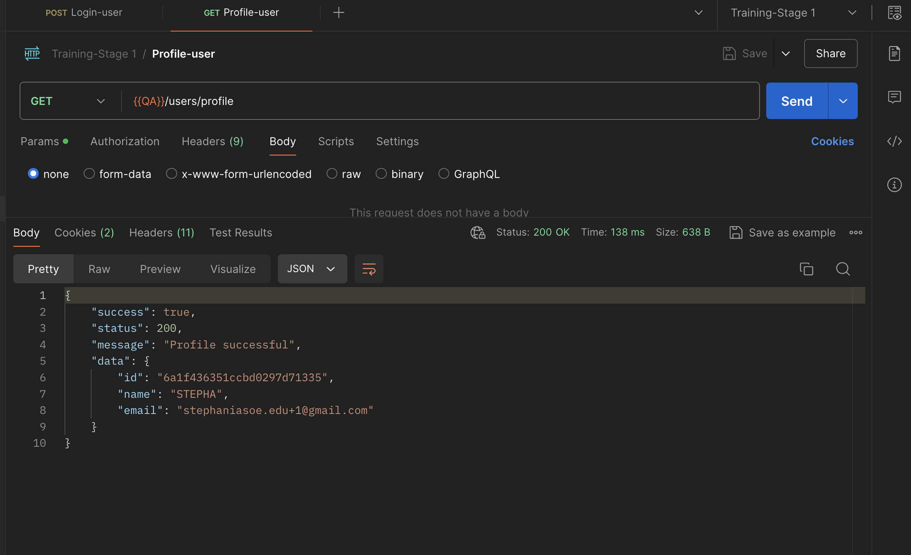
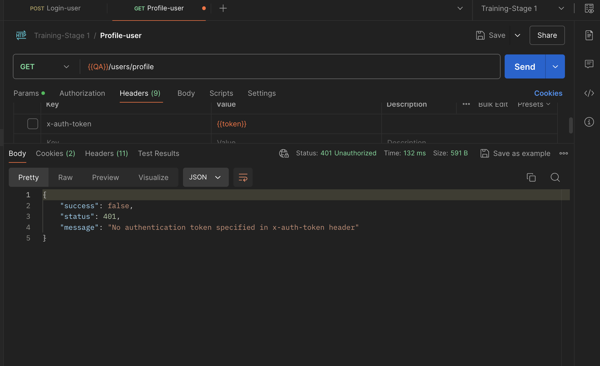
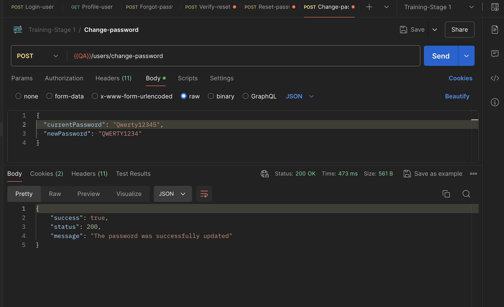

# Entrega: Pruebas Manuales de API - Gestión de Cuenta de Usuario


## Objetivo

El objetivo de esta entrega es validar manualmente mediante Postman los servicios relacionados con la gestión de cuenta de un usuario registrado, incluyendo inicio de sesión, consulta de perfil, cambio de contraseña y recuperación de cuenta.

---

## Historia de usuario

Como usuario registrado de la aplicación, quiero poder consultar mi perfil, cambiar mi contraseña y recuperar mi cuenta si olvido mi clave, para mantener el acceso a mis notas y gestionar mi cuenta de forma segura.

---

## Criterios de aceptación

* El usuario registrado debe poder iniciar sesión con credenciales válidas.
* El usuario registrado debe poder consultar la información de su perfil mediante un endpoint protegido.
* El sistema debe rechazar la consulta del perfil cuando no se envíe un token válido.
* El usuario debe poder cambiar su contraseña si envía correctamente su contraseña actual.
* El sistema no debe permitir el cambio de contraseña cuando la contraseña actual sea incorrecta o la nueva contraseña no cumpla las reglas de seguridad.
* El usuario debe poder iniciar sesión con la nueva contraseña después del cambio.
* El usuario debe poder solicitar recuperación de cuenta con un correo registrado.
* El sistema no debe procesar la recuperación cuando el correo no esté registrado o tenga un formato inválido.
* El usuario debe poder validar un token de recuperación válido.
* El usuario debe poder restablecer su contraseña usando un token de recuperación válido.
* El sistema debe rechazar tokens de recuperación inválidos o expirados.

---

## Alcance de las pruebas manuales

Las pruebas manuales se ejecutan en Postman sobre los endpoints de la API relacionados con autenticación y gestión de cuenta.

Las funcionalidades cubiertas son:

1. Inicio de sesión.
2. Consulta de perfil.
3. Cambio de contraseña.
4. Recuperación de cuenta.
5. Validación de token de recuperación.
6. Restablecimiento de contraseña.

---

## Estrategia de prueba manual

La estrategia consiste en ejecutar casos positivos y negativos desde Postman, validando las respuestas de la API de acuerdo con los criterios de aceptación definidos para la historia de usuario.

Durante la ejecución se validan:

* Código de respuesta HTTP.
* Mensaje de respuesta.
* Estructura del body.
* Datos retornados por la API.
* Manejo de errores.
* Restricciones de acceso a endpoints protegidos.
* Comportamiento esperado en escenarios positivos y negativos.

---

## Precondiciones generales

* La API debe estar disponible.
* El usuario debe estar registrado en la aplicación.
* Se debe contar con credenciales válidas del usuario de prueba.
* Para los endpoints protegidos, se debe contar con un token válido.
* El token de autenticación se obtiene al ejecutar el endpoint de login.
* En Postman se debe configurar una variable de entorno para reutilizar el token en las demás peticiones.
* Para el flujo de recuperación de contraseña, el token de recuperación llega al correo del usuario y no es expuesto directamente por la API.

---

## Variables sugeridas en Postman

Se recomienda configurar un ambiente en Postman con las siguientes variables:

| Variable | Descripción |
| --- | --- |
| `base_url` | URL base de la API |
| `auth_token` | Token de autenticación obtenido en el login |
| `user_email` | Correo del usuario registrado |
| `current_password` | Contraseña actual del usuario |
| `new_password` | Nueva contraseña a configurar |
| `recovery_token` | Token de recuperación recibido por correo |

---

## Casos de prueba en Gherkin BDD

### Feature 1: Autenticación y Perfil

```gherkin
Feature: Autenticación y consulta de perfil por API

  Como usuario registrado
  Quiero iniciar sesión y consultar mi perfil mediante la API
  Para validar que puedo acceder de forma segura a mi información

  Background:
    Given que el usuario está registrado en la aplicación

  Scenario: CP01 - Iniciar sesión correctamente
    When envía una petición POST al endpoint de login con credenciales válidas
    Then la API debe responder con status code 200
    And debe retornar un token de autenticación válido

  Scenario: CP02 - Consultar perfil correctamente
    Given que el usuario obtuvo un token de autenticación válido
    When envía una petición GET al endpoint de perfil
    And envía el token en el header correspondiente
    Then la API debe responder con status code 200
    And la respuesta debe mostrar los datos del usuario

  Scenario: CP03 - Consultar perfil sin token válido
    When envía una petición GET al endpoint de perfil sin token o con token inválido
    Then la API debe responder con status code 401
    And debe mostrarse un mensaje indicando que el usuario no está autorizado
```

---

### Feature 2: Cambio de Contraseña

```gherkin
Feature: Cambio de contraseña por API

  Como usuario registrado
  Quiero cambiar mi contraseña actual mediante la API
  Para proteger el acceso a mi cuenta

  Background:
    Given que el usuario está registrado en la aplicación
    And cuenta con un token de autenticación válido

  Scenario: CP04 - Cambiar contraseña correctamente
    Given que el usuario conoce su contraseña actual
    When envía una petición al endpoint de cambio de contraseña
    And envía su contraseña actual correctamente
    And envía una nueva contraseña válida
    Then la API debe responder con status code 200
    And la contraseña debe actualizarse correctamente

  Scenario: CP05 - No permitir cambio de contraseña con datos inválidos
    When envía una petición al endpoint de cambio de contraseña
    And envía una contraseña actual incorrecta o una nueva contraseña inválida
    Then la API debe responder con status code 400 o 401
    And la contraseña no debe actualizarse

  Scenario: CP06 - Iniciar sesión con la nueva contraseña
    Given que el usuario cambió su contraseña correctamente
    When envía una petición POST al endpoint de login usando la nueva contraseña
    Then la API debe responder con status code 200
    And debe retornar un token de autenticación válido
```

---

### Feature 3: Recuperación de Cuenta

```gherkin
Feature: Recuperación de cuenta por API

  Como usuario registrado
  Quiero recuperar mi cuenta si olvido mi contraseña
  Para no perder el acceso a mis notas

  Background:
    Given que el usuario está registrado en la aplicación

  Scenario: CP07 - Solicitar recuperación con correo registrado
    When envía una petición al endpoint de recuperación de cuenta
    And envía un correo registrado
    Then la API debe responder con status code 200
    And debe mostrarse un mensaje confirmando el envío de instrucciones de recuperación

  Scenario: CP08 - No permitir recuperación con correo inválido o no registrado
    When envía una petición al endpoint de recuperación de cuenta
    And envía un correo no registrado o con formato inválido
    Then la API debe responder con status code 400 o 404
    And no deben enviarse instrucciones de recuperación

  Scenario: CP09 - Validar token de recuperación
    Given que el usuario recibió un token de recuperación en su correo
    When envía una petición al endpoint de validación de token
    And envía un token de recuperación válido
    Then la API debe responder con status code 200
    And debe confirmar que el token es válido

  Scenario: CP10 - Restablecer contraseña con token válido
    Given que el usuario recibió un token de recuperación válido
    When envía una petición al endpoint de restablecimiento de contraseña
    And envía una nueva contraseña válida
    Then la API debe responder con status code 200
    And la contraseña debe restablecerse correctamente

  Scenario: CP11 - No permitir restablecimiento con token inválido o expirado
    When envía una petición al endpoint de restablecimiento de contraseña
    And envía un token inválido o expirado
    Then la API debe responder con status code 400 o 401
    And la solicitud debe ser rechazada
```

---

## Ejecución en Postman

Las pruebas se ejecutan manualmente en Postman utilizando la colección exportada en formato JSON.

### Pasos de ejecución

1. Abrir Postman.
2. Importar el archivo JSON de la colección.
3. Configurar el ambiente de pruebas y las variables necesarias.
4. Ejecutar el endpoint de login para obtener el token.
5. Guardar el token en una variable de entorno.
6. Usar el token en los endpoints protegidos.
7. Ejecutar los casos de prueba incluidos en la colección.
8. Validar:

   * Status code.
   * Mensaje de respuesta.
   * Estructura del body.
   * Datos retornados por la API.
9. Guardar evidencias de los resultados obtenidos.

---

## Resultados esperados

Los resultados esperados de las pruebas manuales son:

* El login debe retornar un token válido cuando las credenciales sean correctas.
* La consulta de perfil debe retornar la información del usuario cuando se envíe un token válido.
* La consulta de perfil debe ser rechazada cuando no se envíe token o cuando el token sea inválido.
* El cambio de contraseña debe ejecutarse correctamente cuando la contraseña actual sea válida.
* El cambio de contraseña debe ser rechazado cuando la contraseña actual sea incorrecta o la nueva contraseña no cumpla las reglas de seguridad.
* El usuario debe poder iniciar sesión con la nueva contraseña después del cambio.
* La recuperación de cuenta debe procesarse correctamente cuando el correo esté registrado.
* La recuperación de cuenta debe rechazarse cuando el correo no exista o tenga un formato inválido.
* La validación de token de recuperación debe ser exitosa cuando el token sea válido.
* El restablecimiento de contraseña debe completarse cuando el token de recuperación sea válido.
* El restablecimiento de contraseña debe rechazarse cuando el token sea inválido o esté expirado.

---

## Evidencias

Las evidencias pueden incluir:

* Capturas de ejecución en Postman.
  Captura del login exitoso.
  
  Captura de consulta de perfil exitosa. 
  
  Captura de consulta sin token. 
  
  Captura de cambio de contraseña exitoso. 
  
  Captura de Recuperacion de contraseña exitoso.
  
  
  Captura de intento con contraseña incorrecta. 
  
  Captura de recuperación de cuenta. 
  

