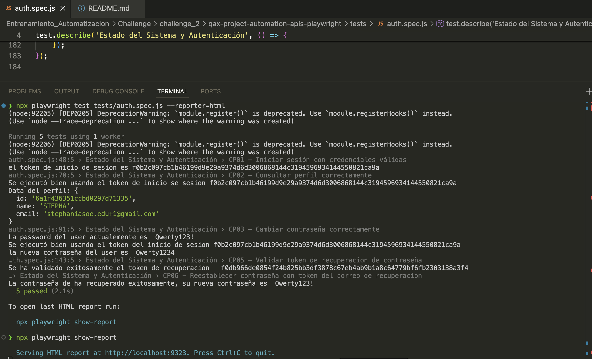

# Automatización de Pruebas API con JavaScript y Playwright - Gestión de Cuenta de Usuario

## Objetivo

El objetivo de esta entrega es validar mediante automatización con JavaScript y Playwright los servicios relacionados con la gestión de cuenta de un usuario registrado, incluyendo inicio de sesión, consulta de perfil, cambio de contraseña y recuperación de cuenta.

---

## Historia de usuario

Como usuario registrado de la aplicación, quiero poder consultar mi perfil, cambiar mi contraseña y recuperar mi cuenta si olvido mi clave, para mantener el acceso a mis notas y gestionar mi cuenta de forma segura.

---

## Criterios de aceptación

* El usuario registrado debe poder iniciar sesión con credenciales válidas.
* El usuario registrado debe poder consultar la información de su perfil mediante un endpoint protegido.
* El sistema debe rechazar la consulta del perfil cuando no se envíe un token válido.
* El usuario debe poder cambiar su contraseña si envía correctamente su contraseña actual.
* El sistema no debe permitir el cambio de contraseña cuando la contraseña actual sea incorrecta o la nueva contraseña no cumpla las reglas de seguridad.
* El usuario debe poder iniciar sesión con la nueva contraseña después del cambio.
* El usuario debe poder solicitar recuperación de cuenta con un correo registrado.
* El sistema no debe procesar la recuperación cuando el correo no esté registrado o tenga un formato inválido.
* El usuario debe poder validar un token de recuperación válido.
* El usuario debe poder restablecer su contraseña usando un token de recuperación válido.
* El sistema debe rechazar tokens de recuperación inválidos o expirados.

---

## Alcance de la automatización

Se creó un archivo JavaScript para automatizar los endpoints principales de la historia de usuario usando Playwright.

La automatización cubre los principales flujos positivos de autenticación, consulta de perfil, cambio de contraseña y recuperación de cuenta.

También se documentan escenarios negativos que hacen parte de la cobertura funcional, aunque no todos quedaron automatizados en esta entrega.

Las funcionalidades cubiertas son:

1. Inicio de sesión.
2. Consulta de perfil.
3. Cambio de contraseña.
4. Login con nueva contraseña.
5. Solicitud de recuperación de contraseña.
6. Validación de token de recuperación.
7. Restablecimiento de contraseña.

---

## Estrategia de automatización

La estrategia de automatización consiste en consumir los endpoints de la API desde Playwright utilizando JavaScript.

El flujo automatizado obtiene el token de autenticación desde el endpoint de login y lo reutiliza en las peticiones protegidas.

Se validan:

* Status code esperado.
* Mensajes de respuesta esperados.
* Obtención del token de autenticación.
* Reutilización del token de autenticación.
* Ejecución de endpoints protegidos.
* Cambio correcto de contraseña.
* Login con la nueva contraseña.
* Solicitud de recuperación de contraseña.
* Validación de token de recuperación cuando el token está disponible.
* Restablecimiento de contraseña cuando el token está disponible.
* Logs en consola para confirmar datos importantes del flujo.

---

## Precondiciones generales

* La API debe estar disponible.
* El usuario debe estar registrado en la aplicación.
* Se debe contar con credenciales válidas del usuario de prueba.
* Para los endpoints protegidos, se debe obtener un token válido mediante el endpoint de login.
* En la automatización con JavaScript, el token de login se guarda en una variable para usarlo en los endpoints protegidos.
* Para el flujo de recuperación de contraseña, el token de recuperación llega al correo del usuario y no es expuesto directamente por la API.
* Para continuar con el flujo de recuperación, el token recibido por correo debe ingresarse manualmente en el archivo de prueba cuando sea necesario.

---

## Herramientas utilizadas

* JavaScript.
* Node.js.
* Playwright.
* Reporte HTML de Playwright.
* Logs en consola para seguimiento del flujo.

---

## Endpoints automatizados

Los endpoints incluidos en la automatización fueron:

* Iniciar sesión.
* Consultar el perfil del usuario.
* Cambiar la contraseña del usuario.
* Solicitar la recuperación de contraseña.
* Validar el token de recuperación de contraseña.
* Restablecer la contraseña del usuario.

---

## Consideración sobre la recuperación de contraseña

Los endpoints relacionados con la recuperación de contraseña fueron parcialmente automatizados.

Esto se debe a que, al solicitar la recuperación de contraseña, la API envía el token de recuperación al correo del usuario. Este token no es expuesto en la respuesta de la API por motivos de seguridad.

Por esta razón, para continuar con el flujo automatizado, fue necesario tomar el token recibido en el correo y dejarlo hardcodeado temporalmente en el archivo JavaScript.

Esta solución permite validar el flujo de recuperación y restablecimiento de contraseña, aunque no representa una automatización completa de extremo a extremo.

---

## Estado de automatización por escenario

| ID | Escenario | Estado |
| --- | --- | --- |
| CP01 | Iniciar sesión correctamente | Automatizado |
| CP02 | Consultar perfil correctamente | Automatizado |
| CP03 | Consultar perfil sin token válido | No automatizado |
| CP04 | Cambiar contraseña correctamente | Automatizado |
| CP05 | No permitir cambio de contraseña con datos inválidos | No automatizado |
| CP06 | Iniciar sesión con la nueva contraseña | Automatizado |
| CP07 | Solicitar recuperación con correo registrado | Automatizado |
| CP08 | No permitir recuperación con correo inválido o no registrado | No automatizado |
| CP09 | Validar token de recuperación | Parcialmente automatizado |
| CP10 | Restablecer contraseña con token válido | Parcialmente automatizado |
| CP11 | No permitir restablecimiento con token inválido o expirado | No automatizado |

---

## Casos de prueba en Gherkin BDD

### Feature 1: Autenticación y Perfil

```gherkin
Feature: Autenticación y consulta de perfil por API

  Como usuario registrado
  Quiero iniciar sesión y consultar mi perfil mediante la API
  Para validar que puedo acceder de forma segura a mi información

  Background:
    Given que el usuario está registrado en la aplicación

  @Automatizado
  Scenario: CP01 - Iniciar sesión correctamente
    When envía una petición POST al endpoint de login con credenciales válidas
    Then la API debe responder con status code 200
    And debe retornar un token de autenticación válido

  @Automatizado
  Scenario: CP02 - Consultar perfil correctamente
    Given que el usuario obtuvo un token de autenticación válido
    When envía una petición GET al endpoint de perfil
    And envía el token en el header correspondiente
    Then la API debe responder con status code 200
    And la respuesta debe mostrar los datos del usuario

  @NoAutomatizado
  Scenario: CP03 - Consultar perfil sin token válido
    When envía una petición GET al endpoint de perfil sin token o con token inválido
    Then la API debe responder con status code 401
    And debe mostrarse un mensaje indicando que el usuario no está autorizado
```

---

### Feature 2: Cambio de Contraseña

```gherkin
Feature: Cambio de contraseña por API

  Como usuario registrado
  Quiero cambiar mi contraseña actual mediante la API
  Para proteger el acceso a mi cuenta

  Background:
    Given que el usuario está registrado en la aplicación
    And cuenta con un token de autenticación válido

  @Automatizado
  Scenario: CP04 - Cambiar contraseña correctamente
    Given que el usuario conoce su contraseña actual
    When envía una petición al endpoint de cambio de contraseña
    And envía su contraseña actual correctamente
    And envía una nueva contraseña válida
    Then la API debe responder con status code 200
    And la contraseña debe actualizarse correctamente

  @NoAutomatizado
  Scenario: CP05 - No permitir cambio de contraseña con datos inválidos
    When envía una petición al endpoint de cambio de contraseña
    And envía una contraseña actual incorrecta o una nueva contraseña inválida
    Then la API debe responder con status code 400 o 401
    And la contraseña no debe actualizarse

  @NoAutomatizado
  Scenario: CP06 - Iniciar sesión con la nueva contraseña
    Given que el usuario cambió su contraseña correctamente
    When envía una petición POST al endpoint de login usando la nueva contraseña
    Then la API debe responder con status code 200
    And debe retornar un token de autenticación válido
```

---

### Feature 3: Recuperación de Cuenta

```gherkin
Feature: Recuperación de cuenta por API

  Como usuario registrado
  Quiero recuperar mi cuenta si olvido mi contraseña
  Para no perder el acceso a mis notas

  Background:
    Given que el usuario está registrado en la aplicación

  @Automatizado
  Scenario: CP07 - Solicitar recuperación con correo registrado
    When envía una petición al endpoint de recuperación de cuenta
    And envía un correo registrado
    Then la API debe responder con status code 200
    And debe mostrarse un mensaje confirmando el envío de instrucciones de recuperación

  @NoAutomatizado
  Scenario: CP08 - No permitir recuperación con correo inválido o no registrado
    When envía una petición al endpoint de recuperación de cuenta
    And envía un correo no registrado o con formato inválido
    Then la API debe responder con status code 400 o 404
    And no deben enviarse instrucciones de recuperación

  @ParcialmenteAutomatizado
  Scenario: CP09 - Validar token de recuperación
    Given que el usuario recibió un token de recuperación en su correo
    When envía una petición al endpoint de validación de token
    And envía un token de recuperación válido
    Then la API debe responder con status code 200
    And debe confirmar que el token es válido

  @ParcialmenteAutomatizado
  Scenario: CP10 - Restablecer contraseña con token válido
    Given que el usuario recibió un token de recuperación válido
    When envía una petición al endpoint de restablecimiento de contraseña
    And envía una nueva contraseña válida
    Then la API debe responder con status code 200
    And la contraseña debe restablecerse correctamente

  @NoAutomatizado
  Scenario: CP11 - No permitir restablecimiento con token inválido o expirado
    When envía una petición al endpoint de restablecimiento de contraseña
    And envía un token inválido o expirado
    Then la API debe responder con status code 400 o 401
    And la solicitud debe ser rechazada
```

---

## Ejecución de pruebas automatizadas

Las pruebas automatizadas se ejecutan desde el archivo JavaScript creado con Playwright.

Para ejecutar el archivo de automatización, se utiliza el siguiente comando:

```bash
npx playwright test tests/auth.spec.js
```

---

## Generación de reporte HTML

Después de la ejecución, se puede consultar el reporte HTML de Playwright con el siguiente comando:

```bash
npx playwright show-report
```

El reporte permite revisar:

* Escenarios ejecutados.
* Estado de cada prueba.
* Tiempo de ejecución.
* Errores en caso de fallos.
* Evidencia técnica de la corrida.

---

## Resultados de automatización

| Flujo | Estado |
| --- | --- |
| Inicio de sesión | Automatizado |
| Consulta de perfil | Automatizado |
| Cambio de contraseña | Automatizado |
| Login con nueva contraseña | No Automatizado |
| Solicitud de recuperación de contraseña | Automatizado |
| Validación de token de recuperación | Parcialmente automatizado |
| Restablecimiento de contraseña | Parcialmente automatizado |
| Consulta de perfil sin token válido | No automatizado |
| Cambio de contraseña con datos inválidos | No automatizado |
| Recuperación con correo inválido o no registrado | No automatizado |
| Restablecimiento con token inválido o expirado | No automatizado |

---

## Observación técnica

La recuperación de contraseña no quedó completamente automatizada porque el token de recuperación no es retornado por la API.

El token llega al correo del usuario y fue necesario ingresarlo manualmente en el código para continuar con el flujo.

Esta implementación permite validar el comportamiento principal del flujo, pero se recomienda como mejora futura integrar algun mecanismo que permita obtener le token desde el email.

---

## Evidencias

Las evidencias pueden incluir:

* Captura de ejecución en consola con Playwright.
  
* Archivo JavaScript de automatización.

* Reporte HTML.
  
