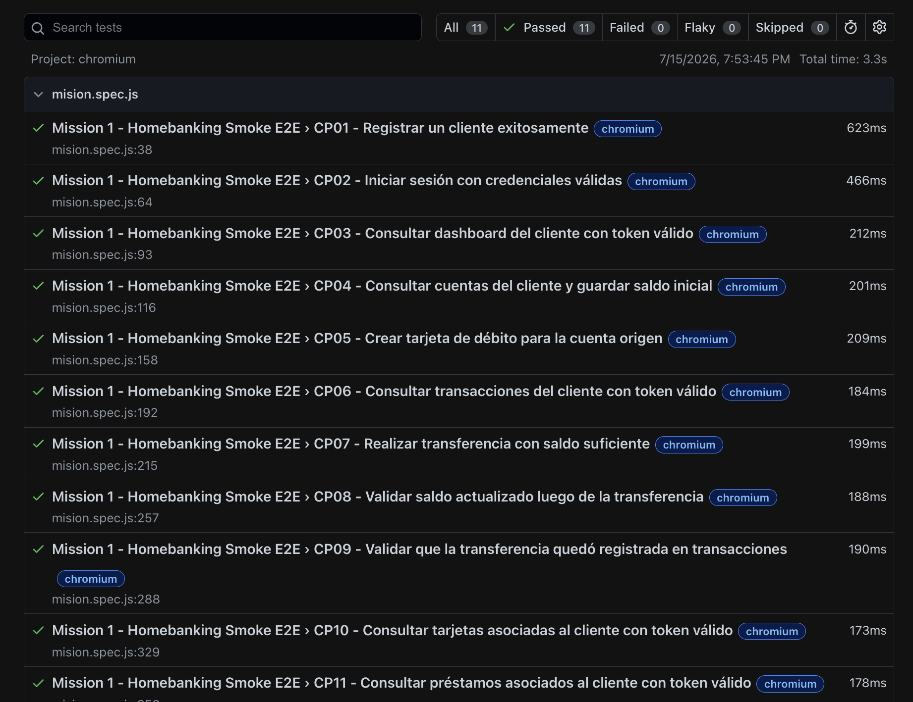

# Mission 1 - Homebanking Mock API

## Estado de la entrega

Entrega correspondiente a la misión de Automatización de APIs - Homebanking Mock API.

En esta misión se realizó el análisis del Swagger, el mapeo de servicios en Postman, el diseño de casos de prueba manuales en formato Gherkin y la automatización de un Smoke Test crítico con Playwright.

---

## ¿Qué es esta misión?

Esta misión simula una prueba de certificación sobre una API de Homebanking.

El contexto indica que el equipo solo tiene un sprint para validar la salida a producción, por eso no se automatizan todos los escenarios.

La idea principal es ser estratégica y automatizar un flujo crítico que permita validar que el cliente pueda:

- Registrarse.
- Iniciar sesión.
- Consultar su dinero.
- Realizar una transferencia.
- Verificar que el saldo cambió.
- Confirmar que la operación quedó registrada.

---

## Objetivo de la misión

Validar que el sistema bancario funcione en su nivel más básico y crítico.

El Smoke Test automatizado responde esta pregunta:

```text
¿El cliente puede entrar al Homebanking, ver su dinero, transferir dinero y confirmar que la operación quedó registrada?
```

---

## Herramientas utilizadas

- Swagger para analizar la documentación de la API.
- Postman para probar manualmente los endpoints.
- JSON para enviar y recibir información.
- JavaScript para escribir los tests.
- Playwright para automatizar pruebas de API.
- Git y GitHub para versionar y entregar el proyecto.

---

## Análisis del Swagger

Se revisó la documentación Swagger de la API:

```text
https://homebanking-demo.onrender.com/docs#/
```

Desde el Swagger se identificaron los servicios principales del sistema Homebanking.

Los endpoints se agruparon por módulos para entender mejor qué funcionalidad del negocio valida cada uno.

---

## Módulos analizados

### Módulo 1 - Resumen de cuentas y movimientos

Servicios relacionados:

- Dashboard del cliente.
- Cuentas asociadas al cliente.
- Historial de movimientos o transacciones.

Criterios que se validan:

- El cliente puede visualizar su información principal.
- El cliente puede consultar sus cuentas.
- El cliente puede ver saldos y monedas.
- El cliente puede consultar sus últimos movimientos.

---

### Módulo 2 - Transferencias y pago de servicios

Servicios relacionados:

- Transferencias.
- Pagos de servicios.
- Historial de transacciones.

Criterios que se validan:

- Transferencia exitosa.
- Transferencia rechazada por fondos insuficientes.
- Pago de servicios correctamente registrado.

---

### Módulo 3 - Gestión de productos financieros

Servicios relacionados:

- Tarjetas.
- Préstamos.
- Plazos fijos.

Criterios que se validan:

- Consultar tarjetas asociadas al cliente.
- Consultar préstamos asociados al cliente.
- Crear y cancelar productos financieros desde pruebas manuales en Postman.

---

### Módulo 4 - Administración del sistema

Servicio relacionado:

- Reset de datos.

Este endpoint fue revisado dentro del análisis y mapeado en la colección de Postman.

---

## Colección de Postman

Se creó una colección de Postman para mapear todos los servicios disponibles en el Swagger.

El archivo de la colección se encuentra anexado al proyecto en formato JSON.

Ubicación:

```text
Postman/homebanking-collection.json
```

La colección incluye servicios de:

- Autenticación.
- Cliente.
- Cuentas.
- Transacciones.
- Transferencias.
- Pagos.
- Tarjetas.
- Préstamos.
- Plazos fijos.
- Sistema.

En Postman se ejecutaron pruebas manuales para conocer cómo responde la API y entender la estructura de los JSON.

---

## Diseño de casos manuales en Gherkin

Como no se automatizan todos los escenarios, se diseñaron casos de prueba manuales en formato Gherkin.

Estos casos cubren Happy Path y Negative Testing.

```gherkin
Feature: Homebanking Mock API

  Como QA Automation
  Quiero validar los servicios principales del Homebanking
  Para asegurar que las funcionalidades críticas funcionen correctamente

  Background:
    Given que la API de Homebanking está disponible

  Scenario: CP01 - Registrar cliente correctamente
    When el cliente envía datos válidos al endpoint de registro
    Then el sistema debe registrar el cliente correctamente

  Scenario: CP02 - Iniciar sesión correctamente
    Given que el cliente está registrado
    When envía credenciales válidas al endpoint de login
    Then el sistema debe devolver un token de autenticación

  Scenario: CP03 - Consultar dashboard con token válido
    Given que el cliente inició sesión correctamente
    When consulta el dashboard usando Bearer Token
    Then el sistema debe devolver la información principal del cliente

  Scenario: CP04 - Consultar cuentas del cliente
    Given que el cliente está autenticado
    When consulta sus cuentas bancarias
    Then el sistema debe listar las cuentas asociadas al cliente

  Scenario: CP05 - Consultar saldo y moneda de las cuentas
    Given que el cliente tiene cuentas asociadas
    When consulta sus cuentas
    Then cada cuenta debe mostrar saldo disponible
    And cada cuenta debe mostrar el tipo de moneda

  Scenario: CP06 - Consultar historial de transacciones
    Given que el cliente está autenticado
    When consulta sus transacciones
    Then el sistema debe devolver un listado de movimientos

  Scenario: CP07 - Validar datos de una transacción
    Given que existen movimientos registrados
    When el cliente consulta el historial
    Then cada movimiento debe tener fecha
    And cada movimiento debe tener monto
    And cada movimiento debe tener concepto

  Scenario: CP08 - Realizar transferencia exitosa
    Given que el cliente tiene saldo suficiente
    When realiza una transferencia a una cuenta válida
    Then el sistema debe procesar la operación correctamente
    And debe devolver un comprobante de la operación

  Scenario: CP09 - Validar saldo actualizado luego de transferencia
    Given que el cliente realizó una transferencia exitosa
    When consulta nuevamente sus cuentas
    Then el saldo de la cuenta origen debe disminuir

  Scenario: CP10 - Validar movimiento registrado luego de transferencia
    Given que el cliente realizó una transferencia exitosa
    When consulta el historial de transacciones
    Then la transferencia debe aparecer registrada

  Scenario: CP11 - Bloquear transferencia por fondos insuficientes
    Given que el cliente no tiene saldo suficiente
    When intenta transferir un monto mayor al disponible
    Then el sistema debe rechazar la operación
    And debe informar que no posee fondos suficientes

  Scenario: CP12 - Pagar servicio correctamente
    Given que el cliente tiene saldo suficiente
    When registra el pago de un servicio
    Then el sistema debe confirmar el pago

  Scenario: CP13 - Bloquear pago por fondos insuficientes
    Given que el cliente no tiene saldo suficiente
    When intenta pagar un servicio
    Then el sistema debe rechazar el pago

  Scenario: CP14 - Consultar tarjetas del cliente
    Given que el cliente está autenticado
    When consulta sus tarjetas
    Then el sistema debe listar las tarjetas asociadas

  Scenario: CP15 - Crear tarjeta
    Given que el cliente tiene una cuenta válida
    When solicita una nueva tarjeta
    Then el sistema debe crear la tarjeta correctamente

  Scenario: CP16 - Eliminar tarjeta
    Given que el cliente tiene una tarjeta activa
    When solicita eliminar la tarjeta
    Then el sistema debe dar de baja la tarjeta

  Scenario: CP17 - Consultar préstamos del cliente
    Given que el cliente está autenticado
    When consulta sus préstamos
    Then el sistema debe listar los préstamos asociados

  Scenario: CP18 - Solicitar préstamo
    Given que el cliente ingresa un monto válido
    When solicita un préstamo
    Then el sistema debe registrar la solicitud

  Scenario: CP19 - Crear plazo fijo
    Given que el cliente tiene saldo disponible
    When crea un plazo fijo
    Then el sistema debe confirmar la inversión

  Scenario: CP20 - Restablecer datos del sistema
    When el administrador QA ejecuta el reset de datos
    Then el sistema debe restaurar la información inicial
```

---

## Smoke Test automatizado

El Smoke Test fue automatizado con Playwright usando JavaScript.

No se automatizaron los 20 casos manuales, porque la misión indica que solo se debe automatizar un flujo crítico.

El archivo automatizado contiene los siguientes casos:

- CP01 - Registrar un cliente exitosamente.
- CP02 - Iniciar sesión con credenciales válidas.
- CP03 - Consultar dashboard del cliente con token válido.
- CP04 - Consultar cuentas del cliente y guardar saldo inicial.
- CP05 - Crear tarjeta de débito para la cuenta origen.
- CP06 - Consultar transacciones antes de transferir.
- CP07 - Realizar transferencia con saldo suficiente.
- CP08 - Validar saldo actualizado luego de la transferencia.
- CP09 - Validar que la transferencia quedó registrada en transacciones.
- CP10 - Consultar tarjetas asociadas al cliente.
- CP11 - Consultar préstamos asociados al cliente.

---

## Lógica del Smoke Test

La lógica del Smoke Test es validar un flujo crítico bancario.

Flujo automatizado:

```text
1. Registrar cliente.
2. Iniciar sesión.
3. Obtener token.
4. Consultar dashboard.
5. Consultar cuentas.
6. Guardar cuenta origen, cuenta destino y saldo inicial.
7. Crear tarjeta de débito asociada a la cuenta origen.
8. Consultar transacciones iniciales.
9. Realizar transferencia con saldo suficiente.
10. Validar que la API devuelva un comprobante de transacción.
11. Consultar cuentas nuevamente.
12. Validar que el saldo de la cuenta origen disminuyó.
13. Consultar transacciones.
14. Validar que la transferencia quedó registrada.
```

Este flujo fue elegido porque permite confirmar que el cliente puede ingresar al Homebanking, consultar su dinero, mover dinero y verificar que la operación quedó registrada.

---

## ¿Por qué este flujo es un Smoke Test?

Este flujo valida las funcionalidades mínimas que no deberían fallar si el banco sale a producción:

- El cliente puede registrarse.
- El cliente puede iniciar sesión.
- El cliente puede ver sus cuentas.
- El cliente puede tener una tarjeta de débito asociada a su cuenta.
- El cliente puede transferir dinero.
- La API devuelve un comprobante de transferencia.
- El sistema actualiza el saldo.
- El sistema registra la operación.

Si este flujo falla, el sistema no debería avanzar a producción porque afecta directamente el dinero del cliente.

---

## Evidencia



---

## Archivo principal del test

El archivo principal del Smoke Test es:

```text
tests/mision.spec.js
```

---

## Cómo ejecutar el proyecto

### 1. Instalar dependencias

```bash
npm install
```

### 2. Ejecutar los tests

```bash
npx playwright test --workers 1
```

Se usa `--workers 1` porque los tests dependen del token, las cuentas y el saldo obtenido en pasos anteriores.

### 3. Ver el reporte HTML

```bash
npx playwright show-report
```

---

## Estructura del proyecto

```text
qax-project-automation-apis-playwright/
│
├── Evidencias/
│   └── image.png
├── tests/
│   └── mision.spec.js
│
├── Postman/
│   └── homebanking-collection.json
│
├── README.md
├── package.json
├── playwright.config.js
└── .gitignore
```

---

## Archivo .gitignore

El proyecto incluye un archivo `.gitignore` para evitar subir archivos innecesarios al repositorio.

Contenido recomendado:

```gitignore
node_modules/
playwright-report/
test-results/
.env
.DS_Store
```

---

## Consideraciones importantes

- Este Smoke Test no automatiza todos los escenarios.
- Los 20 casos manuales quedan documentados en Gherkin.
- La colección de Postman contiene el mapeo completo de servicios del Swagger.
- El Smoke Test automatizado se enfoca en el flujo crítico de dinero.
- Se usa `--workers 1` porque los tests dependen del orden de ejecución.

---

## Notas sobre los datos usados

En el archivo `mision.spec.js` se generan datos dinámicos para evitar errores por usuario repetido.

Ejemplo:

```js
const randomNumber = Date.now();
const userName = `StephaTest${randomNumber}`;
const userEmail = `StephaTest${randomNumber}@test.com`;
```

Esto permite ejecutar el test varias veces sin reutilizar el mismo usuario.

---

## Conclusión

Esta misión permitió practicar el flujo básico de trabajo de una QA Automation:

- Analizar documentación Swagger.
- Probar servicios en Postman.
- Leer respuestas JSON.
- Diseñar casos de prueba manuales en Gherkin.
- Automatizar un Smoke Test crítico con Playwright.
- Usar Authorization Bearer Token.
- Validar una transferencia real.
- Validar actualización de saldo.
- Validar registro de transacción.
- Documentar la solución en un README.

El objetivo no fue automatizar toda la API, sino elegir un flujo crítico que confirme que el sistema bancario funciona en su nivel más importante.
