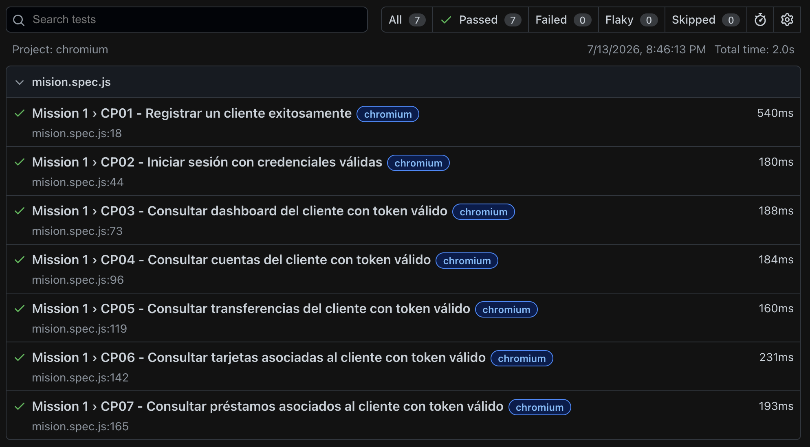

# Mission 1 - Homebanking Mock API

## Estado de la entrega

Entrega correspondiente a la misión de Automatización de APIs - Homebanking Mock API.

En esta misión se realizó el análisis del Swagger, el mapeo de servicios en Postman, el diseño de casos de prueba manuales en formato Gherkin y la automatización de un Smoke Test básico con Playwright.

---

## ¿Qué es esta misión?

Esta misión simula una prueba de certificación sobre una API de Homebanking.

El contexto indica que el equipo solo tiene un sprint para validar la salida a producción, por eso no se automatizan todos los escenarios.

La idea principal es ser estratégica y automatizar solo un flujo básico y crítico que permita validar que el cliente pueda usar las funcionalidades principales del sistema.

---

## Objetivo de la misión

Validar que un cliente pueda:

- Registrarse correctamente.
- Iniciar sesión correctamente.
- Obtener un token de autenticación.
- Consultar su dashboard.
- Consultar sus cuentas bancarias.
- Consultar sus últimos movimientos o transacciones.
- Consultar sus tarjetas asociadas.
- Consultar sus préstamos asociados.

---

## Herramientas utilizadas

- Swagger para analizar la documentación de la API.
- Postman para probar manualmente los endpoints.
- JSON para enviar y recibir información.
- JavaScript para escribir los tests.
- Playwright para automatizar pruebas de API.
- Git y GitHub para versionar y entregar el proyecto.

---

## Análisis del Swagger

Se revisó la documentación Swagger de la API:

```text
https://homebanking-demo.onrender.com/docs#/
```

Desde el Swagger se identificaron los servicios principales del sistema Homebanking.

Los endpoints se agruparon por módulos para entender mejor qué funcionalidad del negocio valida cada uno.

---

## Módulos analizados

### Módulo 1 - Resumen de cuentas y movimientos

Este módulo permite consultar la información principal del cliente.

Servicios relacionados:

- Dashboard del cliente.
- Cuentas asociadas al cliente.
- Historial de movimientos o transacciones.

Criterios que se validan:

- El cliente puede visualizar su información principal.
- El cliente puede consultar sus cuentas.
- El cliente puede ver saldos y monedas.
- El cliente puede consultar sus últimos movimientos.

---

### Módulo 2 - Transferencias y pago de servicios

Este módulo permite validar operaciones donde se mueve dinero.

Servicios relacionados:

- Transferencias.
- Pagos de servicios.
- Historial de transacciones.

Criterios que se validan de forma manual:

- Transferencia exitosa.
- Transferencia rechazada por fondos insuficientes.
- Pago de servicios correctamente registrado.

---

### Módulo 3 - Gestión de productos financieros

Este módulo permite consultar y gestionar productos asociados al cliente.

Servicios relacionados:

- Tarjetas.
- Préstamos.
- Plazos fijos.

Criterios que se validan:

- Consultar tarjetas asociadas al cliente.
- Consultar préstamos asociados al cliente.
- Crear y cancelar productos financieros desde pruebas manuales en Postman.

---

### Módulo 4 - Administración del sistema

Este módulo permite restablecer los datos del sistema.

Servicio relacionado:

- Reset de datos.

Este endpoint fue revisado dentro del análisis y mapeado en la colección de Postman.

---

## Colección de Postman

Se creó una colección de Postman para mapear los servicios disponibles en el Swagger.

El archivo de la colección se encuentra anexado al proyecto en formato JSON.

Ubicación sugerida:

```text
postman/homebanking-collection.json
```

La colección incluye servicios de:

- Autenticación.
- Cliente.
- Cuentas.
- Transacciones.
- Transferencias.
- Pagos.
- Tarjetas.
- Préstamos.
- Plazos fijos.
- Sistema.

En Postman se ejecutaron pruebas manuales para conocer cómo responde la API y entender la estructura de los JSON.

---

## Diseño de casos manuales

Como no se automatizan todos los escenarios, se diseñaron casos de prueba manuales en formato Gherkin.

Estos casos cubren Happy Path y Negative Testing.

---

## Casos de prueba en Gherkin

```gherkin
Feature: Homebanking Mock API

  Como QA Automation
  Quiero validar los servicios principales del Homebanking
  Para asegurar que las funcionalidades críticas funcionen correctamente

  Background:
    Given que la API de Homebanking está disponible

  Scenario: CP01 - Registrar cliente correctamente
    When el cliente envía datos válidos al endpoint de registro
    Then el sistema debe registrar el cliente correctamente

  Scenario: CP02 - Iniciar sesión correctamente
    Given que el cliente está registrado
    When envía credenciales válidas al endpoint de login
    Then el sistema debe devolver un token de autenticación

  Scenario: CP03 - Consultar dashboard con token válido
    Given que el cliente inició sesión correctamente
    When consulta el dashboard usando Bearer Token
    Then el sistema debe devolver la información principal del cliente

  Scenario: CP04 - Consultar cuentas del cliente
    Given que el cliente está autenticado
    When consulta sus cuentas bancarias
    Then el sistema debe listar las cuentas asociadas al cliente

  Scenario: CP05 - Consultar saldo y moneda de las cuentas
    Given que el cliente tiene cuentas asociadas
    When consulta sus cuentas
    Then cada cuenta debe mostrar saldo disponible
    And cada cuenta debe mostrar el tipo de moneda

  Scenario: CP06 - Consultar historial de transacciones
    Given que el cliente está autenticado
    When consulta sus transacciones
    Then el sistema debe devolver un listado de movimientos

  Scenario: CP07 - Validar datos de una transacción
    Given que existen movimientos registrados
    When el cliente consulta el historial
    Then cada movimiento debe tener fecha
    And cada movimiento debe tener monto
    And cada movimiento debe tener concepto

  Scenario: CP08 - Realizar transferencia exitosa
    Given que el cliente tiene saldo suficiente
    When realiza una transferencia a una cuenta válida
    Then el sistema debe procesar la operación correctamente
    And debe devolver un comprobante de la operación

  Scenario: CP09 - Bloquear transferencia por fondos insuficientes
    Given que el cliente no tiene saldo suficiente
    When intenta transferir un monto mayor al disponible
    Then el sistema debe rechazar la operación
    And debe informar que no posee fondos suficientes

  Scenario: CP10 - Pagar servicio correctamente
    Given que el cliente tiene saldo suficiente
    When registra el pago de un servicio
    Then el sistema debe confirmar el pago

  Scenario: CP11 - Consultar tarjetas del cliente
    Given que el cliente está autenticado
    When consulta sus tarjetas
    Then el sistema debe listar las tarjetas asociadas

  Scenario: CP12 - Crear tarjeta
    Given que el cliente tiene una cuenta válida
    When solicita una nueva tarjeta
    Then el sistema debe crear la tarjeta correctamente

  Scenario: CP13 - Eliminar tarjeta
    Given que el cliente tiene una tarjeta activa
    When solicita eliminar la tarjeta
    Then el sistema debe dar de baja la tarjeta

  Scenario: CP14 - Consultar préstamos del cliente
    Given que el cliente está autenticado
    When consulta sus préstamos
    Then el sistema debe listar los préstamos asociados

  Scenario: CP15 - Solicitar préstamo
    Given que el cliente ingresa un monto válido
    When solicita un préstamo
    Then el sistema debe registrar la solicitud

  Scenario: CP16 - Cancelar préstamo
    Given que el cliente tiene un préstamo activo
    When solicita cancelar el préstamo
    Then el sistema debe eliminarlo de sus productos activos

  Scenario: CP17 - Crear plazo fijo
    Given que el cliente tiene saldo disponible
    When crea un plazo fijo
    Then el sistema debe confirmar la inversión

  Scenario: CP18 - Cancelar plazo fijo
    Given que el cliente tiene un plazo fijo activo
    When solicita cancelarlo
    Then el sistema debe dar de baja la inversión

  Scenario: CP19 - Restablecer datos del sistema
    When el administrador QA ejecuta el reset
    Then el sistema debe restaurar los datos iniciales

  Scenario: CP20 - Consultar endpoint protegido sin token
    When el cliente consulta un endpoint privado sin token
    Then el sistema debe rechazar la petición
```

---

## Smoke Test automatizado

El Smoke Test fue automatizado con Playwright usando JavaScript.

No se automatizaron los 20 casos manuales, porque la misión indica que solo se debe automatizar un flujo crítico.

El archivo automatizado contiene los siguientes casos:

- CP01 - Registrar un cliente exitosamente.
- CP02 - Iniciar sesión con credenciales válidas.
- CP03 - Consultar dashboard del cliente con token válido.
- CP04 - Consultar cuentas del cliente con token válido.
- CP05 - Consultar transferencias del cliente con token válido.
- CP06 - Consultar tarjetas asociadas al cliente con token válido.
- CP07 - Consultar préstamos asociados al cliente con token válido.

---

## Lógica del Smoke Test

La lógica del Smoke Test es validar que el cliente pueda entrar al sistema y consultar su información bancaria principal.

Primero se registra un cliente usando:

```text
POST /auth/registro
```

Luego se inicia sesión usando:

```text
POST /auth/login
```

Cuando el login es exitoso, la API devuelve un token.

Ese token se guarda en una variable:

```js
token = responseBody.token;
```

Después, ese token se usa para consultar endpoints protegidos enviándolo en el header:

```js
headers: {
    Authorization: `Bearer ${token}`
}
```

Con el token se consultan estos servicios:

```text
GET /cliente/dashboard
GET /cuentas/
GET /transacciones/?limit=10
GET /tarjetas/
GET /prestamos/
```

---

## ¿Por qué este flujo es un Smoke Test?

Este flujo fue elegido porque valida una parte básica y crítica del negocio.

Si el cliente no puede registrarse, iniciar sesión o consultar su información bancaria, el sistema no estaría listo para producción.

Este Smoke Test responde la pregunta:

```text
¿El cliente puede entrar al Homebanking y ver su información principal?
```

Si la respuesta es sí, el sistema funciona en su nivel más básico.

---

## Evidencia


## Archivo principal del test

El archivo principal del Smoke Test es:

```text
tests/mission1.spec.js
```

---

## Cómo ejecutar el proyecto

### 1. Instalar dependencias

```bash
npm install
```

### 2. Ejecutar los tests

```bash
npx playwright test --workers 1
```

Se usa `--workers 1` porque los tests dependen del token obtenido en el login.

Si los tests se ejecutan en paralelo, puede pasar que un endpoint protegido se ejecute antes de tener el token.

### 3. Ver el reporte HTML

```bash
npx playwright show-report
```

---

## Estructura del proyecto

```text
qax-project-automation-apis-playwright/
│
├── evidencias/
│   └── image.png
├── tests/
│   └── mission1.spec.js
│
├── postman/
│   └── homebanking-collection.json
│
├── README.md
├── package.json
├── playwright.config.js
└── .gitignore
```

---

## Archivo .gitignore

El proyecto incluye un archivo `.gitignore` para evitar subir archivos innecesarios al repositorio.

Contenido recomendado:

```gitignore
node_modules/
playwright-report/
test-results/
.env
.DS_Store
```

---

## Consideraciones importantes

Este Smoke Test valida acceso y consulta de información principal del cliente.

Las operaciones como transferencia exitosa, pago de servicios, creación de tarjetas, solicitud de préstamos y creación de plazos fijos fueron cubiertas en el diseño manual y en la colección de Postman.

En una siguiente mejora se podría automatizar una transferencia exitosa y validar que aparezca en el historial de transacciones.

---

## Notas sobre los datos usados

En el archivo `mission1.spec.js` se usan datos fijos para registrar el cliente.

Ejemplo:

```js
const userName = 'StephaTest212345';
const userEmail = 'StephaTest212345@test.com';
let userPassword = 'Qwerty12';
```

Si el usuario ya existe en la API, el registro puede fallar.

Para evitar ese error en futuras ejecuciones se podría usar un usuario dinámico.

Ejemplo:

```js
const userName = `StephaTest${Date.now()}`;
const userEmail = `StephaTest${Date.now()}@test.com`;
```

---

## Conclusión

Esta misión permitió practicar el flujo básico de trabajo de una QA Automation:

- Analizar documentación Swagger.
- Probar servicios en Postman.
- Leer respuestas JSON.
- Diseñar casos de prueba en Gherkin.
- Automatizar un Smoke Test con Playwright.
- Usar Authorization Bearer Token.
- Documentar la solución en un README.
- Preparar el proyecto para revisión en GitHub.

El objetivo no fue automatizar toda la API, sino elegir un flujo crítico y demostrar que el sistema funciona en su nivel más básico.