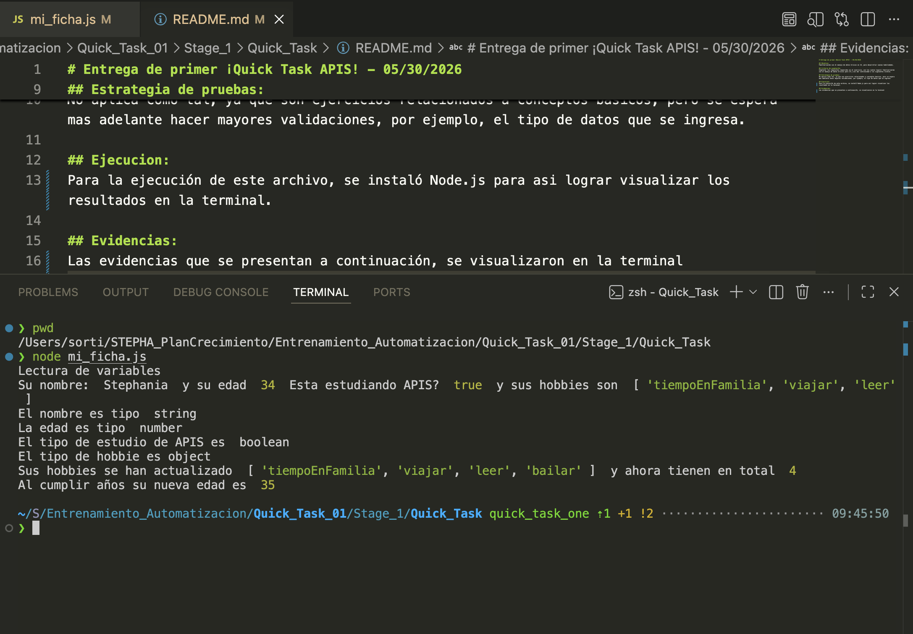

# Entrega de primer ¡Quick Task APIS! - 05/30/2026

## Objetivo:
Familiarizarme con el manejo de datos básicos en JS, para desarrollar nuevas habilidades.

## Criterio de aceptación:
Completar los requisitos requeridos en el ejercicio, con los cuales lograré familiarizarme con el manejo de datos básicos para JS y asi dar continuidad a los siguientes niveles.

## Estrategia de pruebas:
No aplica como tal, ya que son ejercicios relacionados a conceptos basicos, pero se espera mas adelante hacer mayores validaciones, por ejemplo, el tipo de datos que se ingresa.

## Ejecucion:
Para la ejecución de este archivo, se instaló Node.js para asi lograr visualizar los resultados en la terminal.

## Evidencias:
Las evidencias que se presentan a continuación, se visualizaron en la terminal

