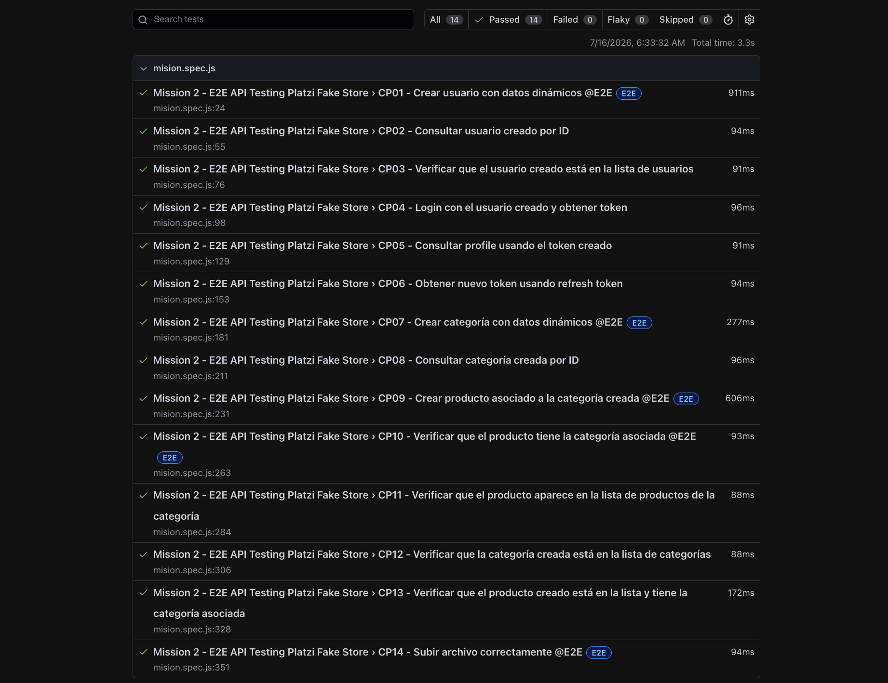
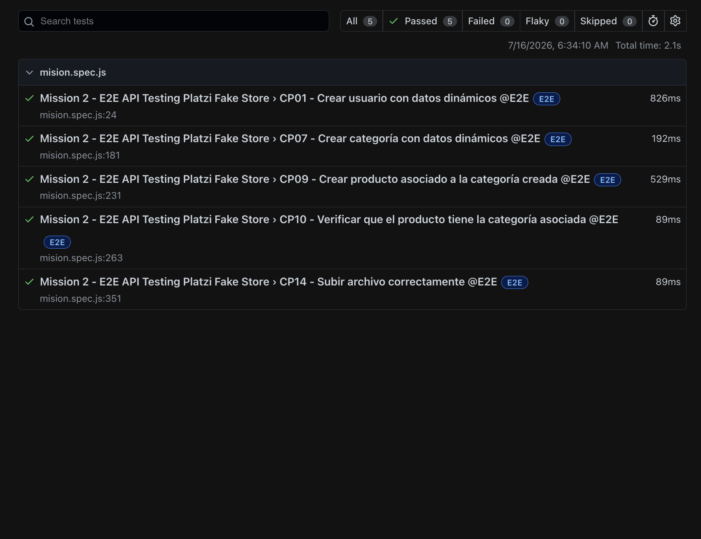

# Mission #2 - E2E API Testing Platzi Fake Store

## Estado de la entrega

Entrega correspondiente a la Mission #2 del Stage 2.

En esta misión se creó un proyecto desde cero con Playwright para automatizar pruebas de API sobre Platzi Fake Store.

La documentación Swagger usada fue:

```text
https://api.escuelajs.co/docs
```

---

## ¿Qué es esta misión?

Esta misión consiste en probar un sistema completo a nivel de API, simulando el trabajo de una QA Automation en un flujo real.

El objetivo no es hacer requests sueltos, sino encadenar peticiones usando datos dinámicos, token de autenticación e IDs generados durante la prueba.

---

## Objetivo de la misión

Validar los módulos principales de Platzi Fake Store usando Playwright.

Módulos trabajados en esta entrega:

- Users
- Auth
- Categories
- Products
- Files

---

## Herramientas utilizadas

- Playwright
- JavaScript
- Swagger
- Node.js
- Git y GitHub

---

## Estructura del proyecto

```text
platzi-fake-store-api/
│
├── tests/
│   └── mision.spec.js
│
├── utils/
│   └── dataGenerator.js
│
├── Evidencias/
│   └── image.png
│
├── playwright.config.js
├── package.json
├── README.md
└── .gitignore
```

---

## Configuración principal

La Base URL fue configurada en el archivo `playwright.config.js`.

```js
use: {
    baseURL: 'https://api.escuelajs.co/api/v1/'
}
```

Esto permite usar endpoints cortos dentro del test, por ejemplo:

```text
users
auth/login
categories/
products/
files/upload
```

Nota importante:

```text
No se deja Content-Type global en la configuración porque el upload de archivos usa multipart/form-data.
```

---

## Archivo principal del test

El flujo automatizado se encuentra en:

```text
tests/mision.spec.js
```

El test se ejecuta de forma serial porque cada paso depende de información generada en pasos anteriores.

---

## Archivo de datos dinámicos

Se creó el archivo:

```text
utils/dataGenerator.js
```

Este archivo contiene funciones para generar datos dinámicos.

Funciones utilizadas:

```text
generateUserData()
generateCategoryData()
generateProductData(categoryId)
```

Estas funciones ayudan a evitar datos repetidos y permiten reutilizar información entre requests.

---

## Diseño de casos en Gherkin

```gherkin
Feature: E2E API Testing - Platzi Fake Store

  Como QA Automation
  Quiero validar los módulos principales de Platzi Fake Store
  Para asegurar que los flujos de API funcionen correctamente

  Background:
    Given que la API de Platzi Fake Store está disponible

  Scenario: CP01 - Crear usuario con datos dinámicos
    When envío una petición POST al endpoint /users con datos válidos
    Then el sistema debe crear el usuario correctamente
    And debe devolver un id válido

  Scenario: CP02 - Consultar usuario creado por ID
    Given que existe un usuario creado
    When consulto el endpoint /users/{id}
    Then el sistema debe devolver los datos del usuario
    And el email debe coincidir con el enviado

  Scenario: CP03 - Verificar usuario creado en la lista
    Given que existe un usuario creado
    When consulto el endpoint /users
    Then el usuario creado debe aparecer en la lista

  Scenario: CP04 - Login con usuario creado
    Given que existe un usuario creado
    When envío sus credenciales al endpoint /auth/login
    Then el sistema debe devolver access_token
    And debe devolver refresh_token

  Scenario: CP05 - Consultar profile con token
    Given que tengo un access_token válido
    When consulto el endpoint /auth/profile usando Bearer Token
    Then el sistema debe devolver el profile del usuario autenticado

  Scenario: CP06 - Obtener nuevo token usando refresh token
    Given que tengo un refresh_token válido
    When envío el refresh_token al endpoint /auth/refresh-token
    Then el sistema debe devolver un nuevo access_token

  Scenario: CP07 - Crear categoría con datos dinámicos
    When envío una petición POST al endpoint /categories con datos válidos
    Then el sistema debe crear la categoría correctamente
    And debe devolver un id válido

  Scenario: CP08 - Consultar categoría creada
    Given que existe una categoría creada
    When consulto el endpoint /categories/{id}
    Then el sistema debe devolver la categoría creada

  Scenario: CP09 - Crear producto asociado a una categoría
    Given que existe una categoría creada
    When envío una petición POST al endpoint /products usando el categoryId
    Then el sistema debe crear el producto correctamente
    And el producto debe quedar asociado a la categoría

  Scenario: CP10 - Consultar producto creado
    Given que existe un producto creado
    When consulto el endpoint /products/{id}
    Then el sistema debe devolver el producto creado
    And la categoría asociada debe coincidir

  Scenario: CP11 - Verificar producto en la lista de productos de la categoría
    Given que existe un producto asociado a una categoría
    When consulto el endpoint /categories/{id}/products
    Then el producto debe aparecer dentro de esa categoría

  Scenario: CP12 - Verificar categoría creada en la lista
    Given que existe una categoría creada
    When consulto el endpoint /categories
    Then la categoría creada debe aparecer en la lista

  Scenario: CP13 - Verificar producto creado en la lista de productos
    Given que existe un producto creado
    When consulto el endpoint /products
    Then el producto debe aparecer en la lista
    And debe mantener la categoría asociada

  Scenario: CP14 - Subir archivo correctamente
    When envío una petición POST al endpoint /files/upload con un archivo válido
    Then el sistema debe subir el archivo correctamente
    And debe devolver información del archivo cargado
```

---

## Módulos automatizados

### 1. Users

Endpoints automatizados:

```text
POST /api/v1/users
GET /api/v1/users/{id}
GET /api/v1/users
```

Validaciones realizadas:

- Se crea un usuario con datos dinámicos.
- La respuesta contiene un `id`.
- El usuario creado se consulta por ID.
- El usuario creado aparece en la lista de usuarios.
- Los datos retornados coinciden con los datos enviados.

---

### 2. Auth

Endpoints automatizados:

```text
POST /api/v1/auth/login
GET /api/v1/auth/profile
POST /api/v1/auth/refresh-token
```

Validaciones realizadas:

- Se hace login con el usuario creado.
- La respuesta contiene `access_token`.
- La respuesta contiene `refresh_token`.
- El token se usa para consultar el profile.
- Se obtiene un nuevo token usando refresh token.

---

### 3. Categories

Endpoints automatizados:

```text
POST /api/v1/categories
GET /api/v1/categories/{id}
GET /api/v1/categories/{id}/products
GET /api/v1/categories
```

Validaciones realizadas:

- Se crea una categoría con datos dinámicos.
- La respuesta contiene un `id`.
- La categoría creada se consulta por ID.
- La categoría creada aparece en la lista de categorías.
- Se consulta la lista de productos asociados a esa categoría.

---

### 4. Products

Endpoints automatizados:

```text
POST /api/v1/products
GET /api/v1/products/{id}
GET /api/v1/products
```

Validaciones realizadas:

- Se crea un producto asociado al `categoryId` generado previamente.
- La respuesta contiene un `id`.
- El producto creado se consulta por ID.
- El producto aparece en la lista de productos.
- El producto mantiene la categoría asociada correctamente.

---

### 5. Files

Endpoint automatizado:

```text
POST /api/v1/files/upload
```

Validaciones realizadas:

- Se sube un archivo usando `multipart/form-data`.
- La respuesta devuelve `originalname`.
- La respuesta devuelve `filename`.
- La respuesta devuelve `location`.

---

## Flujo E2E automatizado

El flujo principal automatizado fue:

```text
1. Crear usuario con datos dinámicos.
2. Guardar el userId.
3. Consultar el usuario creado por ID.
4. Consultar la lista de usuarios y verificar que el usuario creado está presente.
5. Hacer login con el usuario creado.
6. Guardar access_token y refresh_token.
7. Consultar profile usando Authorization Bearer Token.
8. Obtener nuevo token usando refresh token.
9. Crear categoría con datos dinámicos.
10. Guardar el categoryId.
11. Consultar la categoría creada por ID.
12. Crear producto asociado a la categoría creada.
13. Guardar el productId.
14. Consultar el producto creado por ID.
15. Verificar que el producto aparece en la lista de productos de la categoría.
16. Verificar que la categoría creada aparece en la lista de categorías.
17. Verificar que el producto creado aparece en la lista de productos y tiene la categoría asociada.
18. Subir archivo usando el endpoint Files.
```

---

## Manejo de token

Después de crear el usuario, se realiza login usando el email y password generados dinámicamente.

Endpoint:

```text
POST /api/v1/auth/login
```

La respuesta devuelve:

```text
access_token
refresh_token
```

El `access_token` se guarda en una variable:

```js
accessToken = responseBody.access_token;
```

Luego se usa para consultar endpoints protegidos:

```js
headers: {
    Authorization: `Bearer ${accessToken}`
}
```

---

## Manejo de IDs dinámicos

Durante el flujo se guardan IDs para reutilizarlos en otros requests.

Ejemplo con usuario:

```js
userId = responseBody.id;
```

Ejemplo con categoría:

```js
categoryId = responseBody.id;
```

Ejemplo con producto:

```js
productWithCategoryId = responseBody.id;
```

Esto permite encadenar las pruebas y validar información real creada durante la ejecución.

---

## ¿Cómo se asocia el producto a la categoría?

Primero se crea una categoría y se guarda su ID:

```js
categoryId = responseBody.id;
```

Después se genera la data del producto usando ese `categoryId`:

```js
productWithCategoryData = generateProductData(categoryId);
```

Luego se crea el producto con esa información.

Finalmente, se consulta el producto y se valida que la categoría asociada sea la misma que se creó en el flujo.

```js
expect(responseBody.category.id).toBe(categoryId);
```

---

## Cómo ejecutar el proyecto

Instalar dependencias:

```bash
npm install
```

Ejecutar todos los tests:

```bash
npx playwright test --workers 1
```

Ejecutar el flujo E2E usando tag:

```bash
npx playwright test --grep @E2E --workers 1
```

Abrir reporte HTML:

```bash
npx playwright show-report
```

Se usa `--workers 1` porque el flujo depende de variables compartidas entre tests.

---

## .gitignore

El archivo `.gitignore` debe incluir:

```gitignore
node_modules/
playwright-report/
test-results/
.env
```

Esto evita subir dependencias, reportes y archivos temporales al repositorio.

---

## Evidencias




---

## Consideraciones importantes

- La documentación Swagger fue usada como referencia principal.
- El flujo usa datos dinámicos para usuario, categoría y producto.
- El test se ejecuta de forma serial porque hay dependencias entre requests.
- El token obtenido en login se reutiliza en endpoints protegidos.
- El producto se crea usando la categoría generada durante la prueba.
- El módulo Files fue automatizado con upload de archivo en memoria.
- No se usa `Content-Type` global porque el upload necesita `multipart/form-data`.

---

## Conclusión

Esta misión permitió construir un proyecto de automatización API desde cero usando Playwright.

Se validó un flujo E2E con:

- Creación de usuario.
- Login.
- Token.
- Profile.
- Refresh token.
- Creación de categoría.
- Creación de producto asociado a categoría.
- Validaciones por ID.
- Validaciones en listas.
- Upload de archivo.
- Datos dinámicos.

El objetivo fue demostrar que se puede leer Swagger, entender cómo se conectan los endpoints y automatizar un flujo completo de API.
