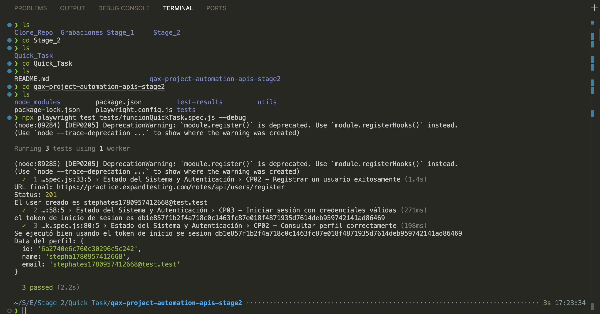
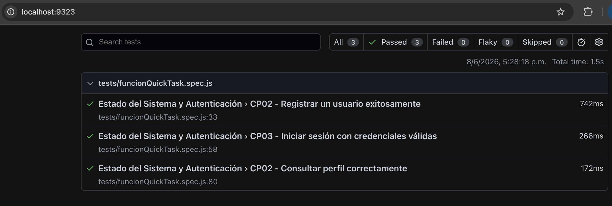

# Quick Task - Creación de Usuario con Playwright API Testing

## ¿Qué es?

Este ejercicio corresponde a una práctica rápida del **Stage_2** de la mentoría, orientada a reforzar conceptos de automatización de APIs usando **Playwright**.

El objetivo principal del ejercicio era crear un usuario mediante una petición API. Adicionalmente, se agregaron validaciones complementarias como plus para fortalecer el flujo automatizado y practicar el consumo de otros endpoints relacionados con autenticación y consulta de perfil.

---

## Título de la entrega

Creación de usuario con datos dinámicos usando Playwright API Testing

---

## Objetivo / Historia de usuario

El objetivo principal de esta entrega es automatizar la creación de un usuario mediante Playwright, usando datos dinámicos para evitar conflictos con usuarios previamente registrados.

Como valor agregado, se incluyeron validaciones adicionales para verificar el estado de la API, iniciar sesión con el usuario creado y consultar su perfil autenticado.

**Historia de usuario:**

Como tester automatizador, quiero crear un usuario mediante una prueba automatizada de API usando Playwright, para validar que el endpoint de registro funciona correctamente con datos válidos y dinámicos.

---

## Criterios de aceptación

* El sistema debe permitir registrar un usuario nuevo con datos válidos.
* El nombre del usuario debe generarse dinámicamente.
* El correo electrónico del usuario debe generarse dinámicamente para evitar conflictos con usuarios previamente registrados.
* El endpoint de registro debe responder con status code `201`.
* La respuesta debe confirmar que la cuenta del usuario fue creada correctamente.
* La URL base de la API debe configurarse globalmente desde `playwright.config.js`.
* Las funciones reutilizables deben estar separadas en un archivo utilitario.

---

## Alcance del ejercicio

El alcance solicitado para la Quick Task era:

1. Crear un usuario mediante API.
2. Usar Playwright para automatizar la petición.
3. Documentar la entrega en un README.

---

## Plus agregados

Además del alcance solicitado, se agregaron los siguientes puntos como mejora:

1. Sanity check del servidor mediante el endpoint de health check.
2. Generación dinámica del nombre del usuario.
3. Generación dinámica del correo electrónico del usuario.
4. Registro exitoso del usuario.
5. Inicio de sesión con el usuario creado.
6. Obtención y reutilización del token de autenticación.
7. Consulta del perfil del usuario autenticado.
8. Uso de una URL base global desde `playwright.config.js`.
9. Uso de funciones reutilizables desde `utils/util.js`.

---

## Estrategia de prueba

La estrategia principal consiste en automatizar el endpoint de registro de usuario usando Playwright.

Para evitar errores por datos repetidos, se implementaron funciones reutilizables que generan un nombre y un correo electrónico únicos en cada ejecución.

Como plus, se agregó un flujo complementario para validar que la API esté disponible, que el usuario creado pueda iniciar sesión correctamente y que sea posible consultar su perfil usando el token obtenido en el login.

---

## Precondiciones

* Tener instalado Node.js.
* Tener instalado Playwright en el proyecto.
* La API debe estar disponible.
* El archivo `playwright.config.js` debe tener configurada la URL base de la API.
* El proyecto debe contar con una carpeta de pruebas.
* El proyecto debe contar con un archivo utilitario para las funciones reutilizables.

---

## Configuración global de la URL base

La URL base de la API se definió en el archivo `playwright.config.js` para evitar repetirla en cada test.

```javascript
module.exports = {
  use: {
    baseURL: 'https://practice.expandtesting.com/notes/api/',

    extraHTTPHeaders: {
      Accept: 'application/json',
    },
  },
};
```

Esta configuración permite consumir los endpoints usando rutas relativas:

```javascript
request.get('health-check');
request.post('users/register');
request.post('users/login');
request.get('users/profile');
```

---

## Datos de prueba

Para evitar errores por usuarios previamente registrados, se generaron datos dinámicos mediante funciones reutilizables.

Los datos generados dinámicamente son:

* Nombre del usuario.
* Correo electrónico del usuario.

Ejemplo de archivo utilitario:

```javascript
function generateRandomEmail() {
    const timestamp = Date.now();
    return 'stephates' + timestamp + '@test.test';
}

function generateRandomName() {
    const timestamp = Date.now();
    return 'stepha' + timestamp;
}

module.exports = {
    generateRandomEmail,
    generateRandomName,
};
```

---

## Nota importante sobre backticks y comillas simples

Un punto importante a recordar es que el carácter **backtick**:

```text
`
```

no es igual a la comilla simple:

```text
'
```

En JavaScript, los **backticks** permiten usar template literals e insertar variables dentro de un texto usando `${}`.

Ejemplo correcto con backticks:

```javascript
const timestamp = Date.now();
const email = `stephates${timestamp}@test.test`;
```

Resultado esperado:

```text
stephates1717791234567@test.test
```

En cambio, si se usan comillas simples:

```javascript
const timestamp = Date.now();
const email = 'stephates${timestamp}@test.test';
```

JavaScript lo interpreta como texto literal y no reemplaza la variable.

Resultado incorrecto:

```text
stephates${timestamp}@test.test
```

Por eso, si se necesita insertar una variable dentro de un string, se deben usar backticks.

---

## Estructura sugerida del proyecto

```text
Stage_2/
└── Quick_Task/
    └── qax-project-automation-apis-stage2/
        ├── tests/
        │   └── funcionQuickTask.spec.js
        ├── utils/
        │   └── util.js
        ├── evidencias/
        ├── playwright.config.js
        ├── package.json
        └── README.md
```

---

## Casos de prueba

### CP01 - Verificar la salud de la API

**Tipo:** Plus agregado.

**Objetivo:**  
Validar que la API se encuentre disponible y responda correctamente.

**Endpoint:**

```text
GET /health-check
```

**Validaciones:**

* El status code debe ser `200`.
* El mensaje de respuesta debe confirmar que la API está en ejecución.

**Resultado esperado:**

```text
Notes API is Running
```

---

### CP02 - Registrar un usuario exitosamente

**Tipo:** Alcance principal del ejercicio.

**Objetivo:**  
Registrar un nuevo usuario usando datos generados dinámicamente.

**Endpoint:**

```text
POST /users/register
```

**Datos enviados:**

* Nombre generado dinámicamente.
* Email generado dinámicamente.
* Password válido.

**Validaciones:**

* El status code debe ser `201`.
* La respuesta debe confirmar la creación exitosa del usuario.
* El usuario debe quedar disponible para iniciar sesión.

**Resultado esperado:**

```text
User account created successfully
```

---

### CP03 - Iniciar sesión con el usuario creado

**Tipo:** Plus agregado.

**Objetivo:**  
Validar que el usuario registrado pueda iniciar sesión correctamente.

**Endpoint:**

```text
POST /users/login
```

**Datos enviados:**

* Email del usuario creado.
* Password del usuario creado.

**Validaciones:**

* El status code debe ser `200`.
* La respuesta debe retornar un token de autenticación.
* El token debe almacenarse para ser usado en endpoints protegidos.

---

### CP04 - Consultar el perfil del usuario autenticado

**Tipo:** Plus agregado.

**Objetivo:**  
Validar que sea posible consultar el perfil del usuario creado usando el token obtenido en el login.

**Endpoint:**

```text
GET /users/profile
```

**Validaciones:**

* El status code debe ser `200`.
* La petición debe enviarse con token de autenticación válido.
* La respuesta debe retornar la información del usuario autenticado.
* Los datos del perfil deben corresponder al usuario creado durante la prueba.

---

## Ejecución

Para ejecutar las pruebas automatizadas, ubicarse en la raíz del proyecto donde se encuentra el archivo `playwright.config.js`.

Ejecutar todos los tests:

```bash
npx playwright test
```

Ejecutar el archivo específico de la Quick Task:

```bash
npx playwright test tests/funcionQuickTask.spec.js
```

Ver el reporte HTML de Playwright:

```bash
npx playwright show-report
```

---

## Resultados esperados

Al ejecutar la automatización se espera que:

* El usuario sea registrado exitosamente con datos únicos.
* El endpoint de registro responda con status code `201`.
* La respuesta confirme la creación exitosa del usuario.
* Como plus, el health check responda correctamente.
* Como plus, el usuario pueda iniciar sesión con las credenciales generadas.
* Como plus, el token obtenido permita consultar el perfil del usuario autenticado.

---

## Resultados obtenidos

Durante la ejecución se validaron correctamente los siguientes puntos:

* La API respondió correctamente al health check.
* Se generó un nombre de usuario dinámico.
* Se generó un correo electrónico dinámico.
* Se registró un usuario exitosamente.
* Se inició sesión con el usuario creado.
* Se obtuvo un token de autenticación.
* Se consultó el perfil del usuario creado usando el token.
* La URL base fue tomada correctamente desde `playwright.config.js`.
* Las funciones reutilizables fueron consumidas desde el archivo `utils/util.js`.

---

## Evidencias

* Captura de ejecución en consola.

* Captura del reporte HTML de Playwright.


---

## Comandos útiles

Ejecutar pruebas:

```bash
npx playwright test
```

Ejecutar un archivo específico:

```bash
npx playwright test tests/funcionQuickTask.spec.js
```

Abrir reporte HTML:

```bash
npx playwright show-report
```

Ejecutar en modo UI:

```bash
npx playwright test --ui
```

---

## Observaciones

Durante la implementación se identificó que, al configurar una `baseURL` con path incluido, es importante finalizar la URL base con `/` y consumir los endpoints sin `/` inicial.

Configuración correcta:

```javascript
baseURL: 'https://practice.expandtesting.com/notes/api/'
```

Uso correcto en los tests:

```javascript
request.get('health-check');
```

Esto permite que Playwright construya correctamente la URL final:

```text
https://practice.expandtesting.com/notes/api/health-check
```

También se identificó que el uso de datos estáticos en el registro puede generar errores `409 Conflict` cuando el usuario ya existe. Para evitarlo, se implementaron funciones para generar datos dinámicos en cada ejecución.

Finalmente, se reforzó la diferencia entre backticks y comillas simples en JavaScript, ya que para insertar variables dentro de un texto se deben usar backticks o concatenación.

---

## Conclusión

La Quick Task fue completada correctamente cumpliendo el alcance principal solicitado: crear un usuario mediante una prueba automatizada de API con Playwright.

Adicionalmente, se agregaron validaciones complementarias como plus, incluyendo health check, login y consulta de perfil del usuario creado.

Estas mejoras permiten tener una automatización más completa, mantenible y menos dependiente de datos fijos.