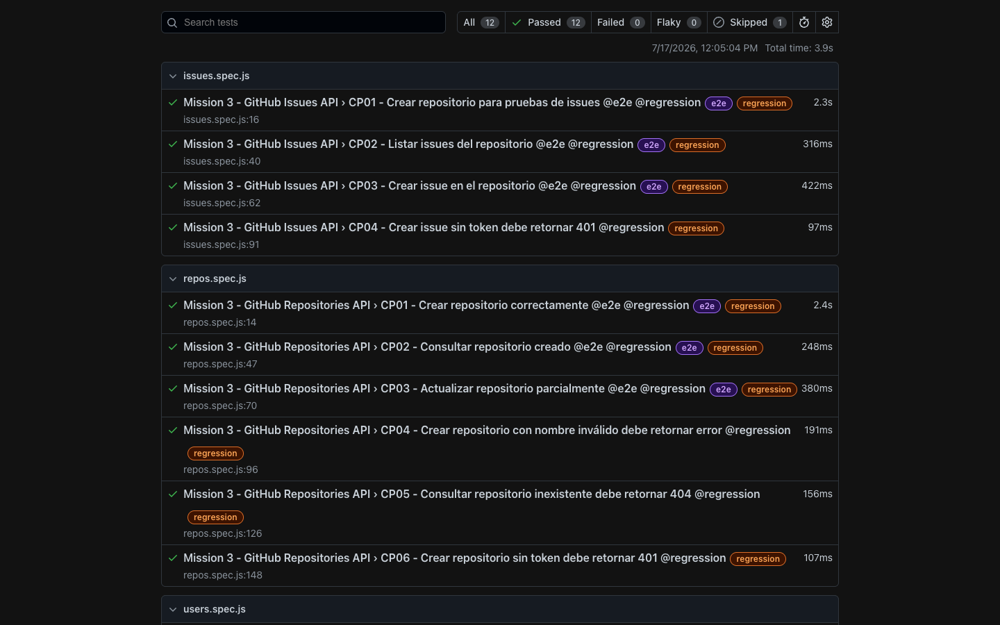
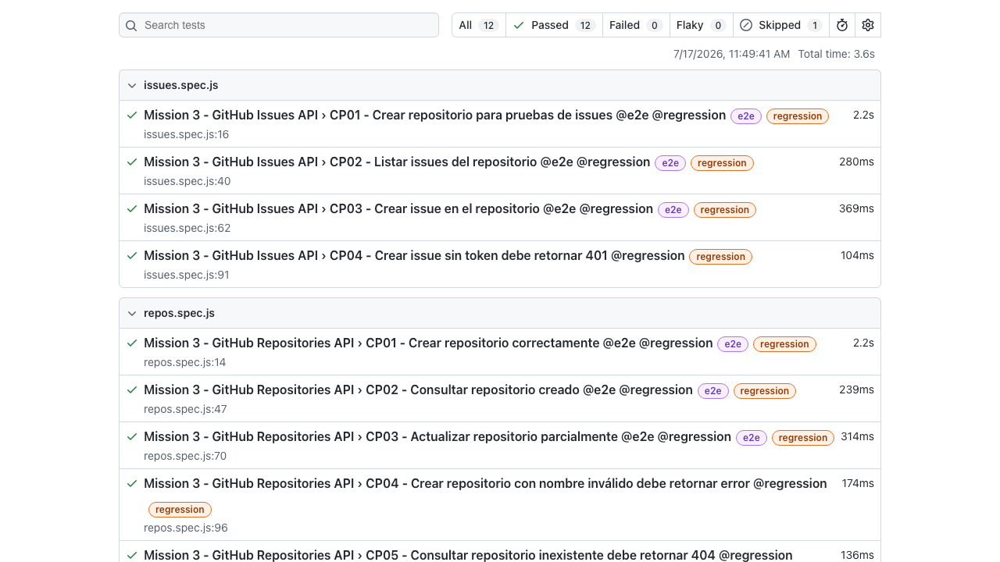
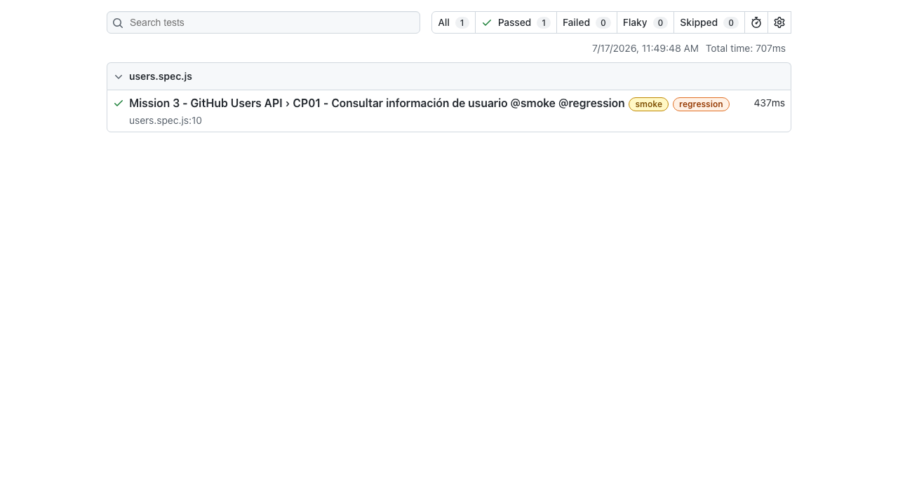
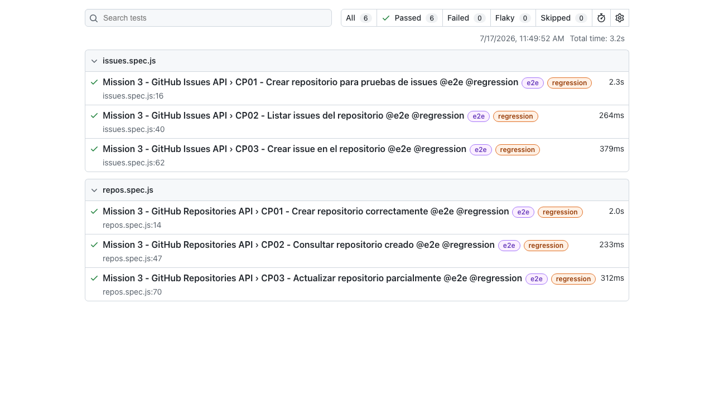

# Mission #3 - Probando GitHub API

## Descripción

Esta misión corresponde al cierre del Stage 3 de automatización API.

El objetivo es trabajar con la GitHub REST API aplicando los conceptos vistos durante el stage:

- Modelos.
- API Service Layer.
- Variables de entorno.
- Autenticación con Personal Access Token.
- Playwright API Testing.
- Colección de Postman.
- Pruebas positivas y negativas.

API utilizada:

```text
https://api.github.com
```

---

## Objetivo

Automatizar flujos principales de la GitHub API, incluyendo:

- Consulta de información de usuario.
- Creación, consulta y actualización de repositorios.
- Listado y creación de issues.
- Validaciones positivas y negativas.

---

## Autenticación

Algunas operaciones requieren autenticación con un Personal Access Token de GitHub.

El token debe guardarse en un archivo `.env.dev` y nunca escribirse directamente en el código.

Ejemplo:

```env
BASE_URL=https://api.github.com
GITHUB_TOKEN=ghp_tu_token_aqui
GITHUB_USERNAME=tu_usuario_github
ENVIRONMENT=dev
```

El archivo `.env.dev` debe estar incluido en `.gitignore`.

---

## Estructura del proyecto

```text
Mission03/
│
├── tests/
│   ├── users.spec.js
│   ├── repos.spec.js
│   └── issues.spec.js
│
├── src/
│   ├── models/
│   │   ├── repoModel.js
│   │   └── issueModel.js
│   │
│   └── services/
│       ├── githubUserService.js
│       ├── githubRepoService.js
│       └── githubIssueService.js
│
├── postman/
│   └── github_api_collection.json
│
├── .env.dev
├── .gitignore
├── package.json
├── playwright.config.js
└── README.md
```

---

## Organización del código

### models/

Contiene funciones para generar bodies dinámicos.

```text
repoModel.js
issueModel.js
```

### services/

Contiene las llamadas centralizadas a la API.

```text
githubUserService.js
githubRepoService.js
githubIssueService.js
```

### tests/

Contiene los tests automatizados.

```text
users.spec.js
repos.spec.js
issues.spec.js
```

---

## Casos de prueba en Gherkin

```gherkin
Feature: HU1 - Consultar información de usuario

  Como QA Automation
  Quiero consultar información de usuarios de GitHub
  Para validar respuestas exitosas y errores controlados del endpoint de usuarios

  Background:
    Given que tengo configurado BASE_URL en el archivo .env.dev

  @smoke @regression
  Scenario: CP01 - Consultar información de usuario
    When consulto el endpoint GET /users/{username}
    Then la respuesta debe tener status 200
    And el campo login no debe estar vacío
    And el campo id debe ser mayor a 0
    And avatar_url debe iniciar con https://
    And repos_url debe iniciar con https://
    And type debe estar presente

  @regression
  Scenario: CP02 - Consultar usuario inexistente
    When consulto un username que no existe
    Then la respuesta debe tener status 404
    And debe devolver un mensaje de error


Feature: HU2 - Gestionar repositorios

  Como QA Automation
  Quiero crear, consultar y actualizar repositorios en GitHub
  Para validar flujos positivos, negativos y restricciones de autenticación

  Background:
    Given que tengo configurado un token válido de GitHub
    And tengo configurado mi username en el archivo .env.dev

  @e2e @regression
  Scenario: CP01 - Crear repositorio correctamente
    When creo un repositorio con datos válidos
    Then la respuesta debe tener status 201
    And debe devolver un id válido
    And el nombre del repositorio debe coincidir con el enviado

  @e2e @regression
  Scenario: CP02 - Consultar repositorio creado
    Given que existe un repositorio creado por la automatización
    When consulto el endpoint GET /repos/{owner}/{repo}
    Then la respuesta debe tener status 200
    And el nombre del repositorio debe coincidir

  @e2e @regression
  Scenario: CP03 - Actualizar repositorio parcialmente
    Given que existe un repositorio creado por la automatización
    When actualizo su descripción con PATCH
    Then la respuesta debe tener status 200
    And la descripción debe actualizarse correctamente

  @regression
  Scenario: CP04 - Crear repositorio con nombre inválido
    When intento crear un repositorio con name vacío
    Then la respuesta debe tener status 422
    And debe devolver un mensaje de error

  @regression
  Scenario: CP05 - Consultar repositorio inexistente
    When consulto un repositorio que no existe
    Then la respuesta debe tener status 404
    And debe devolver un mensaje de error

  @regression
  Scenario: CP06 - Crear repositorio sin token
    Given que preparo una petición sin Authorization Bearer
    When intento crear un repositorio en POST /user/repos
    Then la respuesta debe tener status 401
    And debe devolver un mensaje de error

  @regression
  Scenario: CP07 - Eliminar repositorio creado
    Given que existe un repositorio creado por la automatización
    When se evalúa automatizar DELETE /repos/{owner}/{repo}
    Then el escenario queda marcado con test.fixme por ser destructivo


Feature: HU3 - Gestionar issues

  Como QA Automation
  Quiero listar y crear issues en repositorios de GitHub
  Para validar el flujo principal de issues y errores de autenticación

  Background:
    Given que existe un repositorio creado por la automatización

  @e2e @regression
  Scenario: CP01 - Listar issues de un repositorio
    When consulto el endpoint GET /repos/{owner}/{repo}/issues
    Then la respuesta debe tener status 200
    And la respuesta debe ser una lista

  @e2e @regression
  Scenario: CP02 - Crear issue en repositorio
    When creo un issue con título y descripción
    Then la respuesta debe tener status 201
    And debe devolver un id válido
    And debe devolver un number válido
    And el título debe coincidir con el enviado

  @regression
  Scenario: CP03 - Crear issue sin token
    When intento crear un issue sin Authorization Bearer
    Then la respuesta debe tener status 401
    And debe devolver un mensaje de error
```

---

## Tests implementados

| Archivo | Escenario | Tag |
|---|---|---|
| users.spec.js | Consultar información de usuario | @smoke @regression |
| users.spec.js | Consultar usuario inexistente | @regression |
| repos.spec.js | Crear repositorio | @e2e @regression |
| repos.spec.js | Consultar repositorio creado | @e2e @regression |
| repos.spec.js | Actualizar repositorio | @e2e @regression |
| repos.spec.js | Crear repositorio con nombre inválido | @regression |
| repos.spec.js | Consultar repositorio inexistente | @regression |
| repos.spec.js | Crear repositorio sin token | @regression |
| repos.spec.js | Eliminar repositorio creado | @regression (test.fixme) |
| issues.spec.js | Crear repositorio para issues | @e2e @regression |
| issues.spec.js | Listar issues | @e2e @regression |
| issues.spec.js | Crear issue | @e2e @regression |
| issues.spec.js | Crear issue sin token | @regression |

---

## Colección de Postman

Se creó una colección de Postman con los endpoints probados en esta misión.

Ubicación:

```text
postman/github_api_collection.json
```

La colección está lista para importar en Postman y contiene:

- GET /users/{username}
- GET /users/{username-inexistente}
- POST /user/repos
- GET /repos/{owner}/{repo}
- PATCH /repos/{owner}/{repo}
- POST /user/repos con datos inválidos
- GET /repos/{owner}/{repo-inexistente}
- POST /user/repos sin token
- GET /repos/{owner}/{repo}/issues
- POST /repos/{owner}/{repo}/issues
- POST /repos/{owner}/{repo}/issues sin token

Variables de la colección:

```text
baseUrl
githubToken
githubUsername
repoName
issueTitle
issueNumber
```

Antes de ejecutarla en Postman, se deben actualizar los valores actuales de:

```text
githubToken
githubUsername
repoName
issueTitle
```

Para evitar errores por repositorio repetido, cambia `repoName` por un valor único antes de ejecutar `POST /user/repos`.

---
## Evidencias






## Comandos de instalación

```bash
npm install
```

```bash
npx playwright install
```

---

## Comandos de ejecución

Correr toda la suite:

```bash
npx playwright test
```

Correr solo smoke:

```bash
npx playwright test --grep @smoke
```

Correr solo e2e:

```bash
npx playwright test --grep @e2e
```

Correr solo regression:

```bash
npx playwright test --grep @regression
```

Correr archivo específico:

```bash
npx playwright test tests/repos.spec.js
```

Ver reporte HTML:

```bash
npx playwright show-report
```

---

## Bugs encontrados

No se encontraron bugs funcionales durante la ejecución.

Los errores obtenidos en pruebas negativas corresponden al comportamiento esperado de la API:

- Usuario inexistente retorna 404.
- Repositorio inexistente retorna 404.
- Repositorio con nombre inválido retorna 422.
- Crear repositorio sin token retorna 401.
- Crear issue sin token retorna 401.

Si en una ejecución futura algún endpoint responde diferente a lo documentado, se debe registrar en esta sección con:

- Endpoint afectado.
- Resultado esperado.
- Resultado actual.
- Evidencia.

---

## Escenarios no implementados

Se dejó documentado un escenario con `test.fixme`:

```text
CP07 - Eliminar repositorio creado
```

Motivo:

```text
DELETE de repositorio es una operación destructiva. No se implementó para evitar borrar información por error durante la práctica.
```

---

## Notas importantes

- El token de GitHub no debe subirse al repositorio.
- `.env.dev` debe estar en `.gitignore`.
- Los tests de Playwright generan nombres de repositorios dinámicos.
- En Postman, `repoName` se actualiza manualmente antes de ejecutar la colección.
- Las operaciones de creación y actualización requieren un token válido con permisos suficientes.
- Las pruebas negativas validan errores esperados de la API.

---

## Conclusión

Esta misión permitió practicar automatización API con una API real.

Se aplicaron conceptos de Stage 3 como:

- Service Layer.
- Modelos para request body.
- Variables de entorno.
- Autenticación con token.
- Tags `@smoke`, `@e2e` y `@regression`.
- Validaciones con `expect`.
- Pruebas positivas y negativas.
- Documentación en README.
- Colección de Postman.

El objetivo fue validar flujos reales de GitHub API manteniendo el token seguro y el código organizado.
