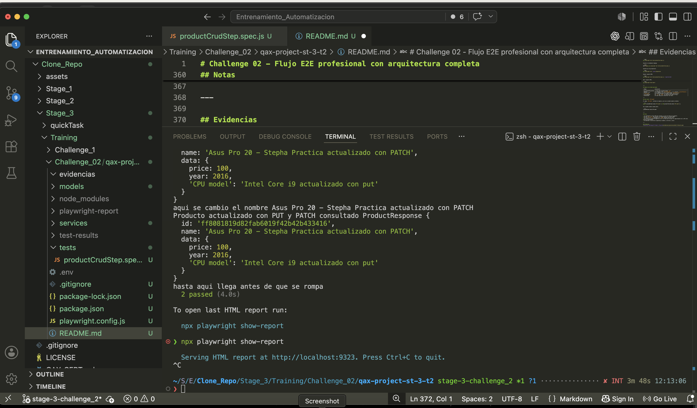
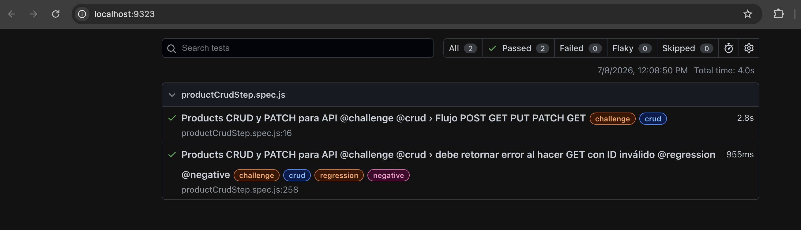

# Challenge 02 - Flujo E2E profesional con arquitectura completa

## Descripción

Este challenge hace parte del Stage 3 de automatización API con Playwright.

El objetivo fue implementar un flujo end-to-end para validar el ciclo de vida completo de un producto, aplicando modelos, service layer, variables de entorno, anotaciones y `test.step`.

API utilizada:

```text
https://api.restful-api.dev
```

---

## Objetivo

Automatizar un flujo E2E para el recurso `objects`, cubriendo:

* Creación del producto con `POST`.
* Consulta del producto creado con `GET`.
* Reemplazo completo con `PUT`.
* Actualización parcial con `PATCH`.
* Verificación final con `GET`.
* Escenario negativo.

---

## Historia de Usuario

Como analista QA de QAXpert,
quiero automatizar el ciclo de vida completo de un producto en el catálogo,
para garantizar que la API gestiona correctamente creación, consulta, reemplazo y actualización parcial.

---

## Base URL

La Base URL se configuró en el archivo `.env`:

```env
BASE_URL=https://api.restful-api.dev
```

---

## Endpoints utilizados

```text
POST /objects
GET /objects/{id}
PUT /objects/{id}
PATCH /objects/{id}
```

---

## Estructura del proyecto

```text
qax-project-st-3-t2/
├── evidencias
├── models/
│   ├── ProductRequest.js
│   └── ProductResponse.js
├── services/
│   └── ProductService.js
├── tests/
│   └── productCrud.spec.js
├── .env
├── .gitignore
├── package.json
├── playwright.config.js
└── README.md
```

---

## Archivos principales

### `ProductRequest.js`

Representa el body que se envía para crear o actualizar completamente un producto.

Ejemplo:

```js
const productToCreate = new ProductRequest(
  'Apple MacBook Pro 16 - Stepha Practica',
  {
    price: 100,
    year: 2016,
    'CPU model': 'Intel Core i9'
  }
);
```

---

### `ProductResponse.js`

Organiza la respuesta de la API para facilitar las validaciones.

Campos principales:

* `id`
* `name`
* `data`
* `createdAt`
* `updatedAt`

También se usa `hasId()` para validar que el producto creado tenga un identificador válido.

---

### `ProductService.js`

Centraliza las peticiones al endpoint `/objects`.

Métodos utilizados:

* `createProduct(productRequest)`
* `getProduct(id)`
* `updateProduct(id, productRequest)`
* `patchProduct(id, fields)`

Los tests no llaman directamente a `request.get`, `request.post`, `request.put` o `request.patch`.

---

### `productCrud.spec.js`

Contiene el flujo E2E principal y un escenario negativo.

El flujo se organiza con `test.step`, permitiendo que cada operación aparezca documentada en el reporte HTML de Playwright.

---

## Flujo automatizado

### Escenario principal - POST → GET → PUT → PATCH → GET

#### 1. POST - Crear producto

Crea un producto inicial:

```json
{
  "name": "Apple MacBook Pro 16 - Stepha Practica",
  "data": {
    "price": 100,
    "year": 2016,
    "CPU model": "Intel Core i9"
  }
}
```

Validaciones:

* Status code `200`.
* El producto tiene un `id`.
* El `name` coincide con el enviado.
* `price`, `year` y `CPU model` coinciden con los datos enviados.

---

#### 2. GET - Consultar producto creado

Consulta el producto usando el `id` generado por el `POST`.

Validaciones:

* Status code `200`.
* El `id` coincide con el obtenido en el `POST`.
* El `name` y la información de `data` coinciden con el producto creado.

---

#### 3. PUT - Reemplazar producto completo

Actualiza completamente el producto con un nuevo payload:

```json
{
  "name": "Apple MacBook Pro 16 - Stepha Practica - actualiza con PUT",
  "data": {
    "price": 100,
    "year": 2016,
    "CPU model": "Intel Core i9 actualizado con put"
  }
}
```

Validaciones:

* Status code `200`.
* El `id` se mantiene.
* El `name` corresponde al nuevo valor.
* `price`, `year` y `CPU model` corresponden al payload del `PUT`.

---

#### 4. PATCH - Actualizar parcialmente

Actualiza únicamente el campo `name`:

```json
{
  "name": "Asus Pro 20 - Stepha Practica actualizado con PATCH"
}
```

Validaciones:

* Status code `200`.
* El `id` se mantiene.
* El `name` cambia al valor enviado.
* Los campos no enviados en el `PATCH` conservan los valores del `PUT`.

---

#### 5. GET - Verificación final

Consulta nuevamente el producto para validar el estado final.

Validaciones:

* Status code `200`.
* El `id` sigue siendo el mismo.
* El `name` corresponde al valor enviado en el `PATCH`.
* Los campos `price`, `year` y `CPU model` conservan los valores del `PUT`.

---

## Escenario negativo

Se agregó un escenario negativo para consultar un producto con un ID inválido.

```text
GET /objects/{id}
```

ID utilizado:

```text
Test negativo
```

Validación esperada:

* Status code `404`.

Este escenario permite validar el comportamiento de la API cuando se consulta un recurso que no existe.

---

## Uso de `test.step`

El flujo principal se dividió en pasos descriptivos usando `test.step`.

Esto permite identificar en el reporte HTML en qué parte del flujo ocurre un error:

* Preparar producto para crear con `POST`.
* Enviar `POST /objects`.
* Validar creación.
* Enviar `GET /objects/{id}`.
* Validar consulta.
* Enviar `PUT /objects/{id}`.
* Validar reemplazo.
* Enviar `PATCH /objects/{id}`.
* Validar actualización parcial.
* Enviar `GET /objects/{id}` final.
* Validar estado final.

---

## Anotaciones utilizadas

* `@challenge`
* `@crud`
* `@regression`
* `@negative`

Ejecutar pruebas por tag:

```bash
npx playwright test --grep @regression
```

```bash
npx playwright test --grep @negative
```

---

## Ejecución

Ejecutar el archivo del challenge:

```bash
npx playwright test tests/productCrud.spec.js
```

Ejecutar con ambiente staging:

```bash
ENV=staging npx playwright test tests/productCrud.spec.js
```

Ejecutar por tag regression:

```bash
npx playwright test --grep @regression
```

Generar reporte HTML:

```bash
npx playwright test tests/productCrud.spec.js --reporter=html
```

Abrir reporte HTML:

```bash
npx playwright show-report
```

---

## Reglas de calidad aplicadas

| Regla                 | Aplicación                                                            |
| --------------------- | --------------------------------------------------------------------- |
| Sin hardcoding de URL | La Base URL se maneja desde `.env`.                                   |
| Modelos               | Los requests usan `ProductRequest` y los responses `ProductResponse`. |
| Service Layer         | Las llamadas a la API se hacen desde `ProductService`.                |
| `test.step`           | El flujo principal se divide en pasos descriptivos.                   |
| ID encadenado         | El `id` del `POST` se reutiliza en todo el flujo.                     |
| Anotaciones           | Se usan tags para clasificar los tests.                               |

---

## Nota sobre `CPU model`

El campo `CPU model` contiene un espacio, por eso se accede usando corchetes:

```js
expect(createdProduct.data['CPU model']).toBe(productToCreate.data['CPU model']);
```

No se puede acceder usando punto:

```js
createdProduct.data.CPU model
```

---

## Notas

* Se implementó un flujo E2E para validar el ciclo de vida de un producto.
* Se usó `test.step` para mejorar la trazabilidad en el reporte HTML.
* Se reutilizó el `id` generado en el `POST` durante todo el flujo.
* Se incluyó un escenario negativo con ID inválido para validar el comportamiento de la API ante recursos inexistentes.
* Se mantiene la estructura separada por modelos, servicios y tests.

---

## Evidencias



---

## Conclusión

El Challenge 02 se completó aplicando la arquitectura trabajada durante el Stage 3.

Este ejercicio permitió automatizar un flujo E2E más completo, validando el estado del producto desde su creación hasta su actualización parcial.
