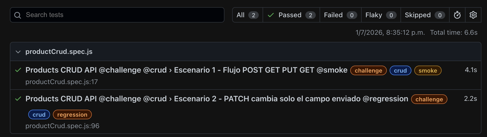
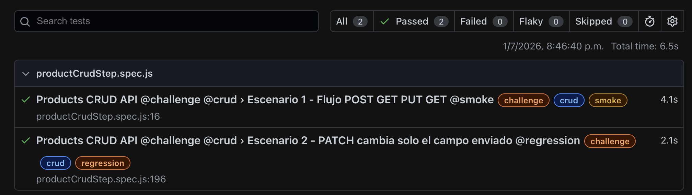

# Challenge 01 - Service Layer con PUT y PATCH

## Descripción

Este challenge extiende la arquitectura trabajada en el ejercicio anterior, agregando soporte para los métodos `PUT` y `PATCH` dentro del `ProductService`.

El objetivo fue completar un flujo CRUD para productos usando Playwright API Testing y reforzar la diferencia entre una actualización completa y una actualización parcial.

API utilizada:

```text
https://api.restful-api.dev
```

---

## Objetivo

Automatizar escenarios API para el recurso `objects`, aplicando:

* Modelos de request y response.
* Service Layer.
* Variables de entorno.
* Métodos `POST`, `GET`, `PUT` y `PATCH`.
* Validaciones con `expect`.
* Anotaciones para clasificar los tests.

---

## Historia de Usuario

Como gestor de inventario,
quiero crear un producto, consultarlo y reemplazarlo totalmente con `PUT`,
para mantener los datos del inventario actualizados de forma confiable.

---

## Base URL

La Base URL se configuró en el archivo `.env`:

```env
BASE_URL=https://api.restful-api.dev
```

---

## Endpoints utilizados

```text
POST /objects
GET /objects/{id}
PUT /objects/{id}
PATCH /objects/{id}
```

---

## Estructura del proyecto

```text
qax-project-st-3-qt/
├── models/
│   ├── ProductRequest.js
│   └── ProductResponse.js
├── services/
│   └── ProductService.js
├── tests/
│   └── products_crud.spec.js
│   └── productCrudSteps.spec.js
├── .env
├── .gitignore
├── package.json
├── playwright.config.js
└── README.md
```

---

## Archivos principales

### `ProductRequest.js`

Representa el body que se envía al crear o actualizar un producto.

Para este challenge se trabajó con productos tipo laptop/equipo Asus.

Ejemplo:

```js
const productToCreate = new ProductRequest(
  'Asus Pro 20 - Stepha Practica',
  {
    price: 100,
    year: 2016,
    'CPU model': 'Intel Core i20'
  }
);
```

Payload enviado a la API:

```json
{
  "name": "Asus Pro 20 - Stepha Practica",
  "data": {
    "price": 100,
    "year": 2016,
    "CPU model": "Intel Core i20"
  }
}
```

---

### `ProductResponse.js`

Organiza la respuesta de la API para facilitar las validaciones.

Campos principales:

* `id`
* `name`
* `data`
* `createdAt`
* `updatedAt`

También se usa el método `hasId()` para validar que el producto creado tenga un identificador válido.

---

### `ProductService.js`

Centraliza las peticiones al endpoint `/objects`.

Métodos implementados:

* `createProduct(productRequest)`
* `getProduct(id)`
* `updateProduct(id, productRequest)`
* `patchProduct(id, fields)`

---

### `products_crud.spec.js`

Contiene los escenarios automatizados del challenge usando:

* `ProductRequest`
* `ProductResponse`
* `ProductService`
* `expect`
* Anotaciones como `@challenge`, `@crud`, `@smoke` y `@regression`

---

## Escenarios automatizados

### Escenario 1 - Flujo POST → GET → PUT → GET

Este escenario valida el flujo principal del challenge.

#### POST /objects

Crea un producto Asus con información técnica dentro de `data`.

Validaciones:

* Status code `200`.
* La respuesta contiene un `id`.
* El `name`, `price`, `year` y `CPU model` coinciden con los datos enviados.

#### GET /objects/{id}

Consulta el producto creado.

Validaciones:

* Status code `200`.
* El `id` coincide con el producto creado.
* La información consultada coincide con los datos enviados en el `POST`.

#### PUT /objects/{id}

Actualiza completamente el producto con un nuevo payload.

Ejemplo de payload:

```json
{
  "name": "Asus Pro 20 - Stepha Practica Actualizado",
  "data": {
    "price": 250,
    "year": 2024,
    "CPU model": "Intel Core i25"
  }
}
```

Validaciones:

* Status code `200`.
* El `id` se mantiene.
* El `name`, `price`, `year` y `CPU model` coinciden con los nuevos datos enviados.

#### GET de verificación

Consulta nuevamente el producto después del `PUT`.

Validaciones:

* Status code `200`.
* El producto refleja los datos actualizados con `PUT`.

---

### Escenario 2 - PATCH cambia solo el campo enviado

Este escenario valida la actualización parcial de un producto.

#### POST /objects

Crea un producto base para la prueba de `PATCH`.

Validaciones:

* Status code `200`.
* La respuesta contiene un `id`.

#### PATCH /objects/{id}

Actualiza únicamente el campo `name`.

Ejemplo:

```json
{
  "name": "Asus Pro 20 - Stepha Practica PATCH"
}
```

Validaciones:

* Status code `200`.
* El `id` se mantiene.
* El `name` cambia al valor enviado.
* El `price`, `year` y `CPU model` conservan sus valores originales.

---

## Diferencia entre PUT y PATCH

### PUT

`PUT` reemplaza completamente el recurso.
Por eso `updateProduct` recibe un `ProductRequest` completo y envía todo el payload.

```js
async updateProduct(id, productRequest) {
  return await this.request.put(`${this.baseEndpoint}/${id}`, {
    data: productRequest.toJSON()
  });
}
```

---

### PATCH

`PATCH` actualiza parcialmente el recurso.
Por eso `patchProduct` recibe solo los campos que se quieren modificar.

```js
async patchProduct(id, fields) {
  return await this.request.patch(`${this.baseEndpoint}/${id}`, {
    data: fields
  });
}
```

---

## Anotaciones utilizadas

* `@challenge`
* `@crud`
* `@smoke`
* `@regression`

Ejecutar por anotación:

```bash
npx playwright test --grep @smoke
```

```bash
npx playwright test --grep @regression
```

---

## Ejecución

Ejecutar todos los tests:

```bash
npx playwright test
```

Ejecutar solo el challenge:

```bash
npx playwright test tests/products_crud.spec.js
```

Ejecutar con un solo worker:

```bash
npx playwright test tests/products_crud.spec.js --workers 1
```

Generar reporte HTML:

```bash
npx playwright test tests/products_crud.spec.js --reporter=html
```

Abrir reporte:

```bash
npx playwright show-report
```

---

## Configuración de variables de entorno

El archivo `.env` contiene:

```env
BASE_URL=https://api.restful-api.dev
```

En `playwright.config.js` se carga con:

```js
const path = require('path');

require('dotenv').config({
  path: path.resolve(__dirname, '.env')
});
```

Esta configuración permite que el archivo `.env` se lea correctamente tanto desde terminal como desde Playwright Test Explorer.

---

## Evidencias

Las evidencias pueden cargarse en la carpeta:

```text
evidencias/
```

Referencia sugerida:

```markdown


```

---

## Notas

* Se trabajó con productos tipo equipo/laptop Asus.
* Se usó `ProductRequest` para crear y actualizar productos.
* Se usó `ProductResponse` para organizar la respuesta.
* Se usó `ProductService` para centralizar las peticiones.
* Se configuró la Base URL con `.env`.
* Se agregó `path.resolve(__dirname, '.env')` para evitar errores al ejecutar desde Playwright Test Explorer.
* `PUT` se usó para reemplazar completamente el producto.
* `PATCH` se usó para actualizar solo el campo enviado.

---

## Conclusión

El challenge se completó extendiendo el Service Layer con soporte para `PUT` y `PATCH`.

Este ejercicio permitió practicar un flujo CRUD más completo con Playwright API Testing, manteniendo una estructura organizada por modelos, servicios y tests.

---
## Nota sobre los archivos de pruebas

En esta entrega se incluyen dos archivos `.spec.js` para el flujo CRUD de productos:

```text
tests/
├── productCrud.spec.js
└── productCrudSteps.spec.js

productCrud.spec.js

Contiene la estructura normal trabajada hasta el momento.
El flujo se implementa de forma lineal, separando las operaciones principales con comentarios:

POST /objects
GET /objects/{id}
PUT /objects/{id}
GET de verificación
PATCH /objects/{id}
GET de verificación
productCrudSteps.spec.js

Contiene la misma lógica del flujo CRUD, pero organizada con test.step.

Esta estructura permite dividir el test en pasos descriptivos, los cuales se visualizan en el reporte HTML de Playwright con su propio estado de ejecución. Esto facilita identificar en qué parte exacta del flujo ocurre un error.

Motivo

Se mantienen ambos archivos para comparar la estructura tradicional del test con una versión más documentada usando test.step.

| Archivo                    | Propósito                                     |
| -------------------------- | --------------------------------------------- |
| `productCrud.spec.js`      | Flujo CRUD con estructura normal.             |
| `productCrudSteps.spec.js` | Mismo flujo CRUD documentado con `test.step`. |
