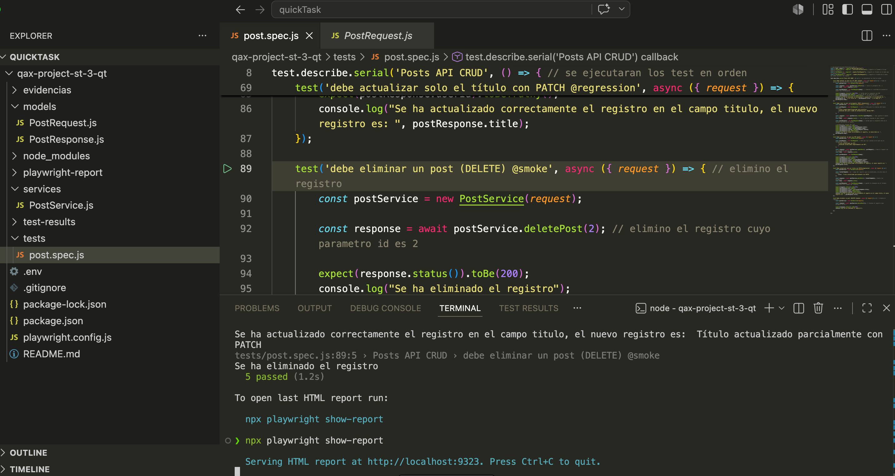
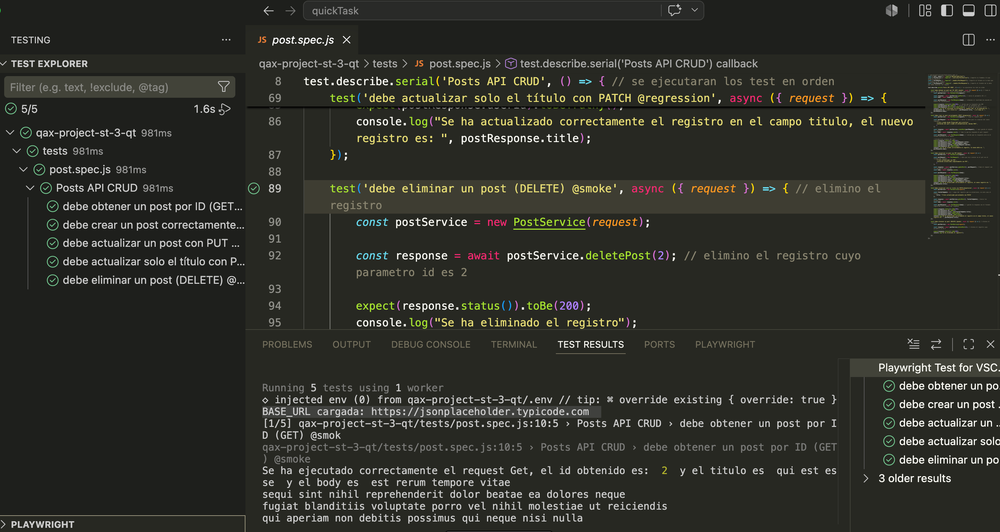

# Quick Task - Post CRUD con JSONPlaceholder

## ¿Qué es?

Esta Quick Task hace parte del warmup de automatización API con Playwright. Para este ejercicio se trabajó con la API pública de JSONPlaceholder, específicamente con el recurso -posts-.

La idea principal fue practicar una estructura un poco más organizada para los tests, separando los datos, los servicios y las validaciones.

API utilizada:

---text
https://jsonplaceholder.typicode.com
---

---

## Objetivo

Automatizar pruebas básicas sobre el recurso -posts-, aplicando los conceptos vistos en el warmup:

* Modelos para request y response.
* Service Layer.
* Variables de entorno.
* Anotaciones en los tests.
* Validaciones con -expect-.

---

## Base URL

La Base URL se configuró desde el archivo -.env-:

---env
BASE_URL=https://jsonplaceholder.typicode.com
---

Esta variable se lee desde -playwright.config.js-, para no dejar la URL escrita directamente en los tests.

---

## Estructura del proyecto

---text
qax-project-st-3-qt/
├── models/
│   ├── PostRequest.js
│   └── PostResponse.js
├── services/
│   └── PostService.js
├── tests/
│   └── posts.spec.js
├── .env
├── evidencias
├── .gitignore
├── package.json
├── playwright.config.js
└── README.md
---

---

## Archivos principales

### -models/PostRequest.js-

Este archivo representa los datos que se envían en el body cuando se crea o se actualiza un post.

Campos usados:

* -title-
* -body-
* -userId-

---

### -models/PostResponse.js-

Este archivo organiza la respuesta que devuelve la API para poder hacer las validaciones de forma más clara.

Campos usados:

* -id-
* -title-
* -body-
* -userId-

También se agregó el método -hasTitle()- para validar que el título exista y no venga vacío.

---

### -services/PostService.js-

Este archivo centraliza las peticiones al endpoint -/posts-.

Métodos creados:

* -getPost(id)-
* -createPost(postRequest)-
* -updatePost(id, postRequest)-
* -patchPost(id, fields)-
* -deletePost(id)-

La idea de este archivo es no escribir todos los -request.get-, -request.post-, -request.put- o -request.patch- directamente dentro del test.

---

### -tests/posts.spec.js-

Este archivo contiene los tests automatizados.

Aquí se usan los modelos, el service y las validaciones con -expect-.

---

## Casos automatizados

### CP01 - Obtener un post por ID

**Endpoint:**

---text
GET /posts/1
---

**Validaciones:**

* Status code -200-.
* El -id- retornado debe ser -1-.
* El post debe tener un título válido.

---

### CP02 - Crear un post

**Endpoint:**

---text
POST /posts
---

**Validaciones:**

* Status code -201-.
* El -title- retornado debe coincidir con el enviado.
* El -body- retornado debe coincidir con el enviado.
* El -userId- retornado debe coincidir con el enviado.
* La respuesta debe contener un -id-.

---

### CP03 - Actualizar un post con PUT

**Endpoint:**

---text
PUT /posts/1
---

**Validaciones:**

* Status code -200-.
* El -id- debe ser -1-.
* El -title-, -body- y -userId- deben coincidir con los datos enviados.

---

### CP04 - Actualizar parcialmente un post con PATCH

**Endpoint:**

---text
PATCH /posts/1
---

**Validaciones:**

* Status code -200-.
* El -id- debe ser -1-.
* El -title- debe coincidir con el valor actualizado.
* El -body- y -userId- deben seguir existiendo en la respuesta.

---

### CP05 - Eliminar un post

**Endpoint:**

---text
DELETE /posts/1
---

Este caso quedó documentado con -test.skip-, por lo tanto no se ejecuta en esta entrega.

---

## Anotaciones utilizadas

Se usaron anotaciones para clasificar algunas pruebas:

* -@smoke-
* -@regression-

Ejecutar pruebas smoke:

---bash
npx playwright test --grep @smoke
---

Ejecutar pruebas regression:

---bash
npx playwright test --grep @regression
---

---

## Ejecución

Ejecutar todos los tests:

---bash
npx playwright test
---

Ejecutar solo el archivo de posts:

---bash
npx playwright test tests/posts.spec.js
---

Generar reporte HTML:

---bash
npx playwright test --reporter=html
---

Abrir reporte HTML:

---bash
npx playwright show-report
---

---

## Resultados esperados

Al ejecutar los tests se espera que:

* La Base URL se tome desde el archivo -.env-.
* Las peticiones se hagan desde -PostService-.
* El body del request se cree desde -PostRequest-.
* La respuesta se organice desde -PostResponse-.
* Los tests de -GET-, -POST-, -PUT- y -PATCH- pasen correctamente.
* El test de -DELETE- quede omitido con -test.skip-.

---

## Evidencias

Las evidencias pueden cargarse en la carpeta:

---text
evidencias/
---

Referencia sugerida:

---markdown

---

---

## Notas

* Se utilizó -PostRequest- para representar el request.
* Se utilizó -PostResponse- para organizar el response.
* Se utilizó -PostService- para centralizar las peticiones.
* Se configuró la Base URL con -.env-.
* Se usó -dotenv- para leer la variable de entorno.
* Se usaron anotaciones -@smoke- y -@regression-.
* Se dejó el caso de eliminación con -test.skip-.
* Se usó -PUT- para actualizar el post completo.
* Se usó -PATCH- para actualizar solo un campo del post.
* Es necesario seguir afianzando los conceptos de modelo, service layer y cómo se conectan con el test, ya que son conceptos nuevos dentro de la estructura del proyecto.
* Durante la ejecución desde Playwright Test Explorer se presentó un error de -Invalid URL-, aunque los tests funcionaban correctamente desde terminal. Esto ocurrió porque la variable -BASE_URL- del archivo -.env- no se estaba cargando correctamente en ese contexto. Para solucionarlo, se configuró -dotenv- con una ruta absoluta usando -path.resolve(__dirname, -.env-)-, asegurando que Playwright siempre encuentre el archivo -.env- sin importar desde dónde se ejecute el test.
---

## Conclusión

La Quick Task se completó usando una estructura separada por modelos, servicios y tests.

Este ejercicio permitió practicar cómo organizar mejor un proyecto de automatización API con Playwright, evitando tener toda la lógica dentro de un solo archivo de test.

Como siguiente paso, se debe seguir reforzando cómo se relacionan los modelos, el service layer y el archivo de pruebas.