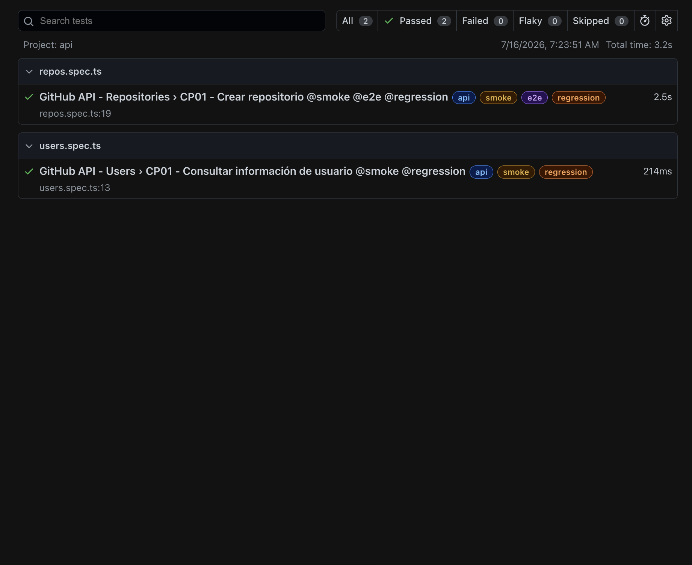
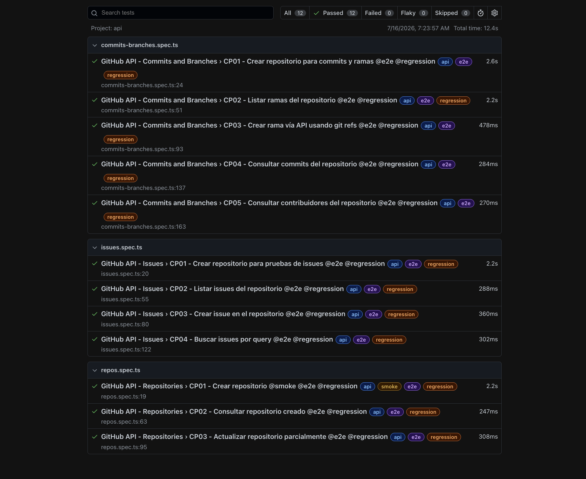
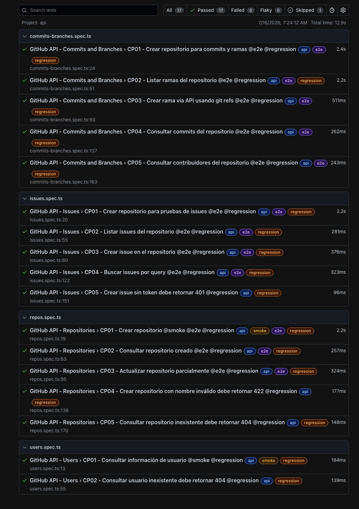

# Mission 4 - GitHub API Testing con TypeScript

Proyecto final de API Testing usando **GitHub REST API + Playwright + TypeScript**.

Esta misión toma como base lo trabajado en Stage 3, pero lo organiza con una arquitectura más profesional:

- TypeScript
- Interfaces para Requests y Responses
- Service Layer por módulo
- Helpers para ambiente, logs y requests HTTP
- Data Builders con datos dinámicos
- Tests con `test.step()` para reportes HTML más claros
- Colección de Postman exportada dentro del proyecto

## API Bajo Prueba

Base URL:

```text
https://api.github.com
```

Autenticación:

```text
Authorization: Bearer GITHUB_TOKEN
```

Variables usadas:

```text
BASE_URL=https://api.github.com
GITHUB_TOKEN=tu_token_github
GITHUB_USERNAME=tu_usuario_github
ENVIRONMENT=dev
```

## Arquitectura

```text
Mission04/
├── postman/
│   └── github_api_collection.json
├── src/
│   ├── builders/
│   │   ├── branch.builder.ts
│   │   ├── issue.builder.ts
│   │   └── repo.builder.ts
│   ├── helpers/
│   │   ├── api.helper.ts
│   │   ├── env.helper.ts
│   │   └── logger.helper.ts
│   ├── services/
│   │   ├── branch.service.ts
│   │   ├── commit.service.ts
│   │   ├── contributor.service.ts
│   │   ├── issue.service.ts
│   │   ├── repo.service.ts
│   │   └── user.service.ts
│   └── types/
│       ├── branch.types.ts
│       ├── commit.types.ts
│       ├── contributor.types.ts
│       ├── issue.types.ts
│       ├── repo.types.ts
│       └── user.types.ts
├── tests/
│   ├── commits-branches.spec.ts
│   ├── issues.spec.ts
│   ├── repos.spec.ts
│   └── users.spec.ts
├── .env.example
├── playwright.config.ts
├── tsconfig.json
└── package.json
```

## Instalación

1. Instalar dependencias:

```bash
npm install
```

2. Crear archivo de ambiente usando `.env.example` como guía.

Opción recomendada para este proyecto:

```bash
cp .env.example .env.dev
```

Luego completar:

```text
BASE_URL=https://api.github.com
GITHUB_TOKEN=tu_token_real
GITHUB_USERNAME=tu_usuario_real
ENVIRONMENT=dev
```

El archivo `.env.dev` no se sube al repositorio porque puede contener el token.

## Comandos

Ejecutar toda la suite:

```bash
npm test
```

Ejecutar smoke:

```bash
npm run test:smoke
```

Ejecutar e2e:

```bash
npm run test:e2e
```

Ejecutar regression:

```bash
npm run test:regression
```

Abrir reporte HTML:

```bash
npm run report
```

También se pueden usar los comandos directos pedidos en el enunciado:

```bash
npx playwright test --grep @smoke
npx playwright test --grep @e2e
npx playwright test --grep @regression
```

## Módulos y Endpoints Cubiertos

| Módulo | Método | Endpoint |
|---|---:|---|
| Usuarios | GET | `/users/{username}` |
| Repositorios | POST | `/user/repos` |
| Repositorios | GET | `/repos/{owner}/{repo}` |
| Repositorios | PATCH | `/repos/{owner}/{repo}` |
| Issues | GET | `/repos/{owner}/{repo}/issues` |
| Issues | POST | `/repos/{owner}/{repo}/issues` |
| Issues | GET | `/search/issues?q=...` |
| Branches | GET | `/repos/{owner}/{repo}/branches` |
| Branches | POST | `/repos/{owner}/{repo}/git/refs` |
| Commits | GET | `/repos/{owner}/{repo}/commits` |
| Contributors | GET | `/repos/{owner}/{repo}/contributors` |

## Tests Implementados

| Archivo | Caso | Tag |
|---|---|---|
| `users.spec.ts` | CP01 - Consultar información de usuario | `@smoke @regression` |
| `users.spec.ts` | CP02 - Consultar usuario inexistente | `@regression` |
| `repos.spec.ts` | CP01 - Crear repositorio | `@smoke @e2e @regression` |
| `repos.spec.ts` | CP02 - Consultar repositorio creado | `@e2e @regression` |
| `repos.spec.ts` | CP03 - Actualizar repositorio parcialmente | `@e2e @regression` |
| `repos.spec.ts` | CP04 - Crear repositorio con nombre inválido | `@regression` |
| `repos.spec.ts` | CP05 - Consultar repositorio inexistente | `@regression` |
| `repos.spec.ts` | CP06 - Eliminar repositorio creado | `test.fixme @regression` |
| `issues.spec.ts` | CP01 - Crear repositorio para pruebas de issues | `@e2e @regression` |
| `issues.spec.ts` | CP02 - Listar issues del repositorio | `@e2e @regression` |
| `issues.spec.ts` | CP03 - Crear issue en el repositorio | `@e2e @regression` |
| `issues.spec.ts` | CP04 - Buscar issues por query | `@e2e @regression` |
| `issues.spec.ts` | CP05 - Crear issue sin token | `@regression` |
| `commits-branches.spec.ts` | CP01 - Crear repositorio para commits y ramas | `@e2e @regression` |
| `commits-branches.spec.ts` | CP02 - Listar ramas del repositorio | `@e2e @regression` |
| `commits-branches.spec.ts` | CP03 - Crear rama vía API usando git refs | `@e2e @regression` |
| `commits-branches.spec.ts` | CP04 - Consultar commits del repositorio | `@e2e @regression` |
| `commits-branches.spec.ts` | CP05 - Consultar contribuidores del repositorio | `@e2e @regression` |

## Casos de Prueba en Gherkin

### Feature: Usuarios de GitHub

```gherkin
@smoke @regression
Scenario: Consultar información de usuario existente
  Given que tengo configurado un usuario válido de GitHub
  When consulto el endpoint GET /users/{username}
  Then la API debe responder status 200
  And la respuesta debe incluir login, id, avatar_url, repos_url y type

@regression
Scenario: Consultar usuario inexistente
  Given que tengo un username que no existe
  When consulto el endpoint GET /users/{username}
  Then la API debe responder status 404
  And la respuesta debe incluir un mensaje de error
```

### Feature: Repositorios

```gherkin
@smoke @e2e @regression
Scenario: Crear repositorio correctamente
  Given que tengo un token válido de GitHub
  And genero datos dinámicos para un repositorio
  When envío una petición POST /user/repos
  Then la API debe responder status 201
  And el repositorio debe crearse con el nombre enviado

@e2e @regression
Scenario: Consultar repositorio creado
  Given que existe un repositorio creado por la automatización
  When consulto GET /repos/{owner}/{repo}
  Then la API debe responder status 200
  And el nombre del repositorio debe coincidir

@e2e @regression
Scenario: Actualizar repositorio parcialmente
  Given que existe un repositorio creado por la automatización
  When envío una petición PATCH /repos/{owner}/{repo}
  Then la API debe responder status 200
  And la descripción debe quedar actualizada

@regression
Scenario: Crear repositorio con nombre inválido
  Given que tengo un body con name vacío
  When envío una petición POST /user/repos
  Then la API debe responder status 422
  And la respuesta debe incluir un mensaje de error

@regression
Scenario: Consultar repositorio inexistente
  Given que tengo el nombre de un repositorio que no existe
  When consulto GET /repos/{owner}/{repo}
  Then la API debe responder status 404
  And la respuesta debe incluir un mensaje de error
```

### Feature: Issues

```gherkin
@e2e @regression
Scenario: Listar issues de un repositorio
  Given que existe un repositorio creado por la automatización
  When consulto GET /repos/{owner}/{repo}/issues
  Then la API debe responder status 200
  And la respuesta debe ser una lista

@e2e @regression
Scenario: Crear issue en un repositorio
  Given que existe un repositorio creado por la automatización
  And genero datos dinámicos para un issue
  When envío una petición POST /repos/{owner}/{repo}/issues
  Then la API debe responder status 201
  And el issue debe quedar creado en estado open

@e2e @regression
Scenario: Buscar issues por query
  Given que existe un repositorio creado por la automatización
  When consulto GET /search/issues?q=...
  Then la API debe responder status 200
  And la respuesta debe incluir total_count e items

@regression
Scenario: Crear issue sin token
  Given que no envío Authorization Bearer
  When intento crear un issue con POST /repos/{owner}/{repo}/issues
  Then la API debe responder status 401
  And la respuesta debe incluir un mensaje de error
```

### Feature: Commits y Ramas

```gherkin
@e2e @regression
Scenario: Listar ramas de un repositorio
  Given que existe un repositorio con commit inicial
  When consulto GET /repos/{owner}/{repo}/branches
  Then la API debe responder status 200
  And la respuesta debe ser una lista de ramas

@e2e @regression
Scenario: Crear rama usando git refs
  Given que tengo el SHA de la rama principal
  When envío una petición POST /repos/{owner}/{repo}/git/refs
  Then la API debe responder status 201
  And la nueva rama debe quedar creada con el SHA base

@e2e @regression
Scenario: Consultar commits del repositorio
  Given que existe un repositorio con commit inicial
  When consulto GET /repos/{owner}/{repo}/commits
  Then la API debe responder status 200
  And la respuesta debe incluir al menos un commit

@e2e @regression
Scenario: Consultar contribuidores del repositorio
  Given que existe un repositorio en GitHub
  When consulto GET /repos/{owner}/{repo}/contributors
  Then la API debe responder status 200
  And la respuesta debe ser una lista
```

## Colección Postman

La colección está en:

```text
postman/github_api_collection.json
```

Variables que se deben configurar manualmente en Postman:

| Variable | Descripción |
|---|---|
| `baseUrl` | URL base de GitHub API |
| `githubToken` | Token personal de GitHub |
| `githubUsername` | Usuario dueño del token |
| `repoName` | Nombre del repo a usar en Postman |
| `issueTitle` | Título del issue que se quiere crear |
| `issueSearchQuery` | Query para buscar issues |
| `newBranchName` | Nombre de la rama nueva |
| `baseBranchSha` | SHA tomado de la respuesta de listar ramas |

## Notas Importantes

- Los tests crean repositorios reales en GitHub con nombres dinámicos que empiezan por `qax-api-`.
- El caso de eliminar repositorio está marcado como `test.fixme` porque `DELETE /repos/{owner}/{repo}` es destructivo.
- Para evitar subir secretos, `.env`, `.env.dev` y otros archivos de ambiente están ignorados por Git.

## Evidencias




## Bugs Encontrados

No se documentan bugs activos de la API en esta entrega.

El escenario de eliminación de repositorio queda como caso no implementado por seguridad, no como bug.
