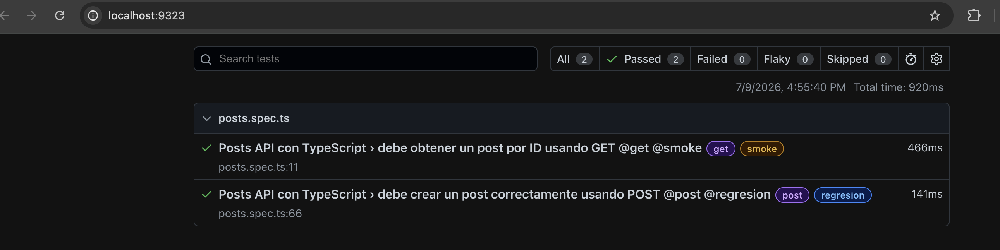

# Auto API Testing Stage 4 - JSONPlaceholder con TypeScript

## Descripción

Este proyecto corresponde a una práctica de automatización API usando **Playwright** y **TypeScript**.

El objetivo fue migrar el conocimiento trabajado anteriormente en JavaScript hacia TypeScript, usando la API pública de JSONPlaceholder y aplicando conceptos como interfaces, service layer, variables de entorno y tags en los tests.

API utilizada:

```text
https://jsonplaceholder.typicode.com
```

---

## Objetivo

Automatizar pruebas básicas sobre el recurso `/posts`, validando los métodos:

```text
GET /posts/{id}
POST /posts
```

---

## Estructura del proyecto

```text
auto_api_testing_stage4/
├── src/
│   ├── types/
│   │   └── post.types.ts
│   └── services/
│       └── PostService.ts
├── tests/
│   └── posts.spec.ts
├── evidencias/
├── .env
├── .gitignore
├── package.json
├── playwright.config.ts
└── tsconfig.json
```

---

## Variables de entorno

La Base URL se configuró en el archivo `.env`:

```env
BASE_URL=https://jsonplaceholder.typicode.com
```

Esto permite no dejar la URL escrita directamente dentro de los tests o services.

---

## Archivos principales

### `post.types.ts`

Contiene las interfaces usadas para tipar la información del request y del response.

Se crearon interfaces para:

* La data que se envía al crear un post.
* La data que responde la API.
* La estructura de respuesta usada por el service.

---

### `PostService.ts`

Contiene el service layer del proyecto.

Desde este archivo se centralizan las llamadas a la API:

* `getPost(id)`
* `createPost(postData)`

Esto permite que los tests no llamen directamente a `request.get` o `request.post`.

---

### `posts.spec.ts`

Contiene los tests automatizados.

Se implementaron dos escenarios principales:

* Consultar un post por ID usando `GET`.
* Crear un post usando `POST`.

Los tests están organizados con el patrón AAA:

* Arrange: preparar datos y service.
* Act: ejecutar el request.
* Assert: validar la respuesta.

---

## Tags usados

```text
@get
@post
@smoke
@regresion
```

---

## Ejecución

Validar TypeScript:

```bash
npx tsc --noEmit
```

Ejecutar los tests con un worker:

```bash
npx playwright test tests/posts.spec.ts --workers 1
```

Ejecutar por tag:

```bash
npx playwright test --grep @get --workers 1
```

```bash
npx playwright test --grep @post --workers 1
```

Abrir reporte HTML:

```bash
npx playwright show-report
```

---

## Evidencias

Las evidencias de ejecución se encuentran en la carpeta evidencias


---
## Notas

* Se migró la estructura anterior de JavaScript a TypeScript.
* Los modelos usados antes en JavaScript se reemplazaron por interfaces.
* Se usó `Service Layer` para separar las llamadas a la API de las validaciones.
* Se mantuvieron logs en consola para entender mejor cada paso de la ejecución.
* Por ahora no se usa `test.step`, para mantener el flujo más simple.

---

## Conclusión

Este proyecto permitió practicar la migración de pruebas API desde JavaScript hacia TypeScript, aplicando una estructura más ordenada y tipada para mejorar la claridad del código y reducir errores.

También permitió empezar a aplicar el patrón AAA — Arrange, Act, Assert — para organizar mejor los tests. Se continuará practicando este patrón para separar de forma más clara la preparación de datos, la ejecución del request y las validaciones de la respuesta.
